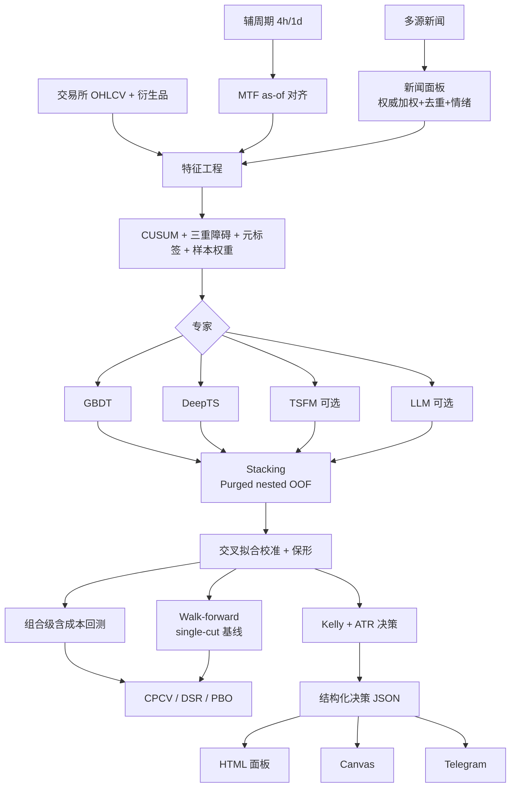

# Crypto-Alpha 系统架构、技术实现与使用说明

> **BTC / ETH** 做多·做空**概率 + 止损/止盈 + 建议仓位**的多专家集成预测系统。  
> 本文基于当前仓库源码（`src/crypto_alpha/`、`config/config.yaml`、`scripts/`）撰写，说明**架构设计、实现细节与完整用法**。  
> ⚠️ 仅供研究学习。金融市场可预测边际小且不稳定；任何结果须经 CPCV/PBO 与纸面交易验证后，才可考虑极小资金实盘。

---

## 目录

1. [设计哲学](#1-设计哲学)
2. [系统总览与数据流](#2-系统总览与数据流)
3. [目录结构](#3-目录结构)
4. [数据层](#4-数据层)
5. [特征层](#5-特征层)
6. [标注层（三重障碍 + 元标签）](#6-标注层)
7. [验证层（Purged CV / CPCV / DSR / PBO）](#7-验证层)
8. [专家层](#8-专家层)
9. [集成层（Stacking）](#9-集成层)
10. [校准层](#10-校准层)
11. [回测层](#11-回测层)
12. [风控与决策层](#12-风控与决策层)
13. [服务与交付层](#13-服务与交付层)
14. [配置全解（config.yaml）](#14-配置全解)
15. [端到端调用链](#15-端到端调用链)
16. [使用说明](#16-使用说明)
17. [脚本索引](#17-脚本索引)
18. [测试](#18-测试)
19. [防泄漏与防过拟合检查表](#19-防泄漏与防过拟合检查表)
20. [扩展指南](#20-扩展指南)
21. [已知局限与路线图](#21-已知局限与路线图)
22. [术语表](#22-术语表)

---

## 1. 设计哲学

系统围绕四条铁律设计：

| 铁律 | 含义 | 落地 |
|------|------|------|
| **无泄漏** | 任意时刻只能用当时可得信息 | 因果特征、MTF as-of、新闻 buffer、Purged+Embargo、nested OOF、交叉拟合校准 |
| **无过拟合** | 回测好看不等于可交易 | CPCV 多路径、DSR、PBO、弱专家剪枝、样本唯一性权重 |
| **概率化 + 风控** | 输出可下注的概率，而非硬涨跌 | 元标签二分类 → 校准 → 保形弃权 → 半 Kelly + ATR 障碍 |
| **优雅降级** | 缺网/缺 GPU/缺依赖仍能跑主干 | 合成行情兜底、TSFM→naive、专家探测跳过、衍生品特征填 0 + `degradations`、新闻缺面板可自动 build 或中性特征 |

**核心范式（AFML 元标签）**——不是直接猜「下一根涨跌」：

1. 简单主策略给出方向 `side ∈ {+1,-1}`（动量 / 均值回归）  
2. **三重障碍**判定该方向在止盈 / 止损 / 超时下是否盈利 → 元标签 `bin ∈ {0,1}`  
3. 多专家学习「该不该执行 + 盈利概率」  
4. 概率校准 + 保形：不自信则 HOLD  
5. 分数 Kelly 定仓；止损/止盈与标注共用 `pt_sl × ATR`

---

## 2. 系统总览与数据流



**默认启用专家**：`gbdt` + `deep_ts`（可在本机 CPU/小卡完成）。`tsfm` / `llm` 可插拔。

---

## 3. 目录结构

```
cryptoCurrency/
├── config/config.yaml              # 唯一参数入口
├── docs/ARCHITECTURE.md            # 本文档
├── scripts/
│   ├── _bootstrap.py               # 注入 src/ 到 sys.path
│   ├── 01_fetch_data.py … 12_audit.py
│   ├── btc_walkforward_summary.py / btc_walkforward_compare.py
│   └── train_llm_qlora.py          # LLM 唯一独立训练入口
├── src/crypto_alpha/
│   ├── config.py
│   ├── data/          fetch / storage / news / sentiment
│   ├── features/      technical / frac_diff / mtf / news_features / build
│   ├── labeling/      triple_barrier / meta_labeling / sample_weights
│   ├── validation/    purged_kfold / cpcv
│   ├── experts/       gbdt / deep_ts / tsfm / llm / base
│   ├── ensemble/      stacking.py
│   ├── calibration/   calibrate.py
│   ├── backtest/      engine.py
│   ├── risk/          sizing.py
│   ├── diagnostics/   integrity.py / gates.py / env_guard.py / experiments.py / decision_audit.py
│   ├── serve/         service.py / notifier.py
│   └── pipeline/      run.py / evaluate.py / report.py / walkforward.py
├── tests/             smoke / leakage / design_fixes / mtf / pipeline_integrity / walkforward
├── data/              运行时 raw / features / news / news_raw
└── artifacts/         模型 / 汇总 / 面板 / adapter
```

包安装布局：`pyproject.toml` 中 `where = ["src"]`，导入名为 `crypto_alpha`。

---

## 4. 数据层

### 4.1 数据获取流程（无需预先准备数据集）

**数据源接口已内置**：行情/衍生品走 `ccxt`，新闻走多源适配器（RSS/API）。OHLCV/funding/OI 等主路径可自动拉取、缓存再训练；**清算全史例外**——公开 REST 盖不住多年 WF，若要训练窗真有清算特征，需 `--import-csv`/付费源或自建 WS 积累（见 §4.2「缺清算覆盖」）。

触发点在 `pipeline/run.prepare_dataset`：默认 `load_symbol_data`（拉行情/缓存/合成）；**决策路径**传 `for_decide=True` 时先 `refresh_market_data`（刷到当下已收盘 tip）→ `build_feature_matrix`（特征；衍生品失败则衍生列填 0）→ `ensure_news_panel` + `add_news_features`（缺新闻面板且 `auto_build_panel` 时自动构建）→ `build_meta_labels`（标签）→ 组装 `Dataset`（`panel/X/y/events/t1/sample_weight` + `degradations`），`train_and_validate` 直接吃这个结构。

| 用法 | 命令 | 说明 |
|------|------|------|
| **全自动（推荐）** | `python scripts/04_train_and_backtest.py` | 训练默认读冷缓存（可关增量）；若 `refresh_before_decide` 则**决策步**另刷 tip 再推理（不重训） |
| **当下决策** | `python scripts/06_decide.py` | `prepare_dataset(..., for_decide=True)`：强制刷到当下已收盘最后一根再训/决策 |
| 分步（想先查数据） | `01_fetch_data.py` → `08_fetch_news.py` → `02_build_features.py` → `03_label.py` → `04_…` | `01/02` 只是提前落盘方便检查，**非训练前置必需**；长历史可用 `scripts/fetch_binance_vision.py` 预填 |

**降级与透明度（重要）**：

- 真实拉取需装 `ccxt` 且有网络；主周期拉取失败时，若 `data.allow_synthetic_fallback: true`（默认）会 **warn 后降级合成**，并在 `DataFrame.attrs["data_source"]=synthetic_fallback` / `Dataset.data_source` / 看板 `data_mode` 中显式标记为「合成(降级)」——**不再只看配置就标「真实」**。
- 设 `allow_synthetic_fallback: false` 可在断网时直接失败，避免误用模拟盘写研究报告。
- 衍生品缺 API key 或断网时**不阻断主流程**：源列可为 NaN，但 `funding_z`/`oi_change`/`liq_imbalance*` 填 0 并记 `derivatives_*_unavailable`（清算另有 `derivatives_liquidations_sparse`），避免清空建模样本。
- 部分新闻源失败时跳过；缺面板可 `auto_build_panel`，仍空则中性特征 + 覆盖率 degradations。
- TSFM 回退 naive、专家探测跳过、部署/CPCV 小样本校准回退等会写入 `degradations` 元数据，避免名实不符。

### 4.2 行情（`data/fetch.py`）

| API | 作用 |
|-----|------|
| `fetch_ohlcv` | ccxt 分页拉取多年 K 线（单次 limit≈1000，循环至 `since`→今） |
| `fetch_ohlcv_resilient` | 按交易所候选列表依次尝试；`for_tip=True` 时优先 `tip_exchange`/fallbacks |
| `fetch_derivatives` | 资金费率 / OI / **可选清算**；分页 `_paginate_funding` / `_paginate_oi` / `_paginate_liquidations`；共用一个 exchange 实例，三路 **各自** try（一路失败不拖另一路）；清算主所空时可另试 `binance→binanceusdm`/`gate` 映射；成功且传入 `cfg` 时 **append** 事件库；失败→NaN 列 |
| `ensure_liquidation_columns` | 旧缓存缺 `liq_long`/`liq_short` 时补 NaN 列（不改已有值） |
| `data/liquidations.py` | 独立事件库 + `attach_liquidations_to_ohlcv` / `fetch_and_store_liquidations` / `import_liquidation_events_frame` |
| `generate_synthetic_ohlcv` | GARCH 味 + regime 合成行情（CI / 离线）；含合成 funding/OI/**清算**列 |
| `load_symbol_data(..., force_refresh=False)` | 统一入口：合成 / 缓存 / 增量 / 降级；`force_refresh` 无视 `incremental_update` 开关 |
| `refresh_market_data` | **决策前**：主周期强制增量到当下已收盘 tip + 辅周期 tip 对齐 + 新鲜度校验 |
| `drop_incomplete_last_bar` | 剔除尚未收盘的尾部 K 线（可连续剔除多根） |
| `assert_fresh_enough` / `closed_bar_lag` | tip 相对「最后一根已收盘」的落后时长；超 `max_closed_bar_lag` 根则 fail-fast |
| `load_aux_timeframes` | 加载辅周期字典 `{tf: df}`；合成主路径强制从 `main_df` 重采样 |
| `resample_ohlcv` | 由主周期重采样辅周期（价格路径一致） |

**缓存约定**

- **统一** `data/raw/<SYMBOL>__{tf}.parquet`（例：主周期 `BTC_USDT__30m.parquet`，辅 `BTC_USDT__4h.parquet`）  
- 遗留无后缀 `BTC_USDT.parquet` **仅当** `tf==1h` 时可读；**30m 绝不回退**到 1h 文件（防周期混用）  
- `cache: true` + `incremental_update: true`：每次 `load_symbol_data` 只拉最后一根之后的新 bar  
- 长历史推荐 Vision CDN 预填（`scripts/fetch_binance_vision.py`，支持 `30m`/`1h`/`4h`/`1d`）；REST 全量多年易超时  

**训练 vs 决策的 tip 语义（重要）**

| 路径 | 行为 |
|------|------|
| 训练 / `04` 的 `prepare_dataset`（默认） | 读冷缓存；`incremental_update: false` 时**不**打 REST，末根 = 缓存末根 |
| `06_decide` / `prepare_dataset(..., for_decide=True)` | `refresh_market_data`：强制增量 → `drop_incomplete_last_bar` → 新鲜度校验 |
| `07_serve.decide_live` | 同上（直接调 `refresh_market_data`） |
| `04` 末尾「最新决策」 | 训练仍用冷缓存；若 `refresh_before_decide` 则**另** `for_decide=True` 组 tip 面板再 `latest_decision`（不重训） |

决策用的「当前 K 线」= **墙上时钟下最后一根已收盘主周期 bar**（开盘时间戳 `t`，可用时刻 `t+Δ`；与 `close_fill` / MTF 决策时刻一致）。未收盘的形成中 bar **不得**进入特征。

**增量 tip 细节**

- 从缓存最后一根**开盘**时刻重拉并 `dedupe(keep=last)`，覆盖可能被修正的 tip。  
- 交易所顺序（`for_tip`）：`tip_exchange` → `exchange_fallbacks` → 主 `exchange`（避免主所 REST 超时拖死决策）。  
- tip 默认**不**重拉 funding/OI（`fetch_derivatives_on_tip: false`）；对新 tip 行：**ffill** 历史 `funding_rate`/`open_interest`（状态量）；**禁止 ffill** `liq_long`/`liq_short`（流量/当根名义额，ffill 会把上根爆仓复制成假信号）。  
- 清算 tip：**独立**于 `fetch_derivatives_on_tip`——`liquidations.fetch_on_tip: true`（默认）时，增量路径以 `tip_only=True` 只扫优先所（默认 gate、短超时）→ append 事件库 → `attach_liquidations_to_ohlcv`。  
- 辅周期：用已刷新主面板 `resample` 的 tip **并入**辅缓存（保留更早独立历史），避免再打多路 REST。  
- 若 tip 实际来自备用所：记 `degradations+=ohlcv_tip_exchange_fallback`（跨所微观价差接缝风险）。  
- `require_fresh_for_decide` + `max_closed_bar_lag`：刷完仍过旧则 **fail-fast**，禁止再用数周前冷缓存装成「当下决策」。

**清算信息源（`fetch_liquidations`，当前默认 false）**

```
交易所 tip/REST
  → _paginate_liquidations（先无 since tip，再 since 分页）
  → data/liquidations/<SYMBOL>.parquet（append 去重）
  → attach_liquidations_to_ohlcv（按主周期 bar 开盘桶）
  → build_feature_matrix → liq_imbalance / *_z
  → prepare_dataset → 可选 liq_align = side × liq_imbalance
```

| 项 | 说明 |
|----|------|
| 源列 | `liq_long`（多头被强平名义，订单 side=SELL）、`liq_short`（空头被强平，side=BUY） |
| 事件库 | `data/liquidations/<SYMBOL>.parquet`；与 OHLCV 冷缓存解耦；`scripts/13_backfill_liquidations.py` 回填 / `--import-csv` / `--refresh-ohlcv` |
| 按 bar 喂入 | `build_feature_matrix` → `attach_liquidations_to_ohlcv`：事件 τ → 开盘 t 满足 `t ≤ τ < t+Δ`（与 volume 同属当根收盘信息；决策时刻 `t+Δ` → **无前视**） |
| 缺史语义 | 首笔活动 bar **之前**置 **NaN**（未知），禁止整段填 0；首笔之后无事件 bar 记 0；**有事件但无一落入面板** → 聚合全 NaN，且 attach **不覆盖**面板已有值，记 `liquidations_outside_panel` |
| 拉取纪律 | `_paginate_liquidations`：**先 tip(无 since)**（Gate 带 `since`/`from` 常空或 400），再 since 分页；符号优先 `BTC/USDT:USDT`；`liquidations.exchanges` 默认 `[gate]`；`merge_all_exchanges: false` 时首所有效即停 |
| tip | `fetch_on_tip: true` + `tip_only=True`：仅优先所、8s 超时，不拖死 `refresh_market_data` |
| 开关 | `data.fetch_liquidations`（**当前 false**：不拉不 attach，有全史/付费库后再开）；`false` 时仍写出全 NaN 列便于特征层统一降级 |
| 外部历史 | `import_liquidation_events_frame` / `--import-csv` 可补多年；**公开 REST alone 无法覆盖 2017→今**——冷缓存训练若事件仅 tip，会 `unavailable`/`sparse`，特征填 0 |
| 降级标签 | 全 NaN → `derivatives_liquidations_unavailable`；有限覆盖率 &lt; 0.5 → `derivatives_liquidations_sparse(coverage=…)` |
| attrs | `liquidations_attached_from_store` / `liquidations_n_events` / `liquidations_bar_coverage` / `liquidations_outside_panel` |

**训练 / 回测窗缺清算覆盖（现状问题，必须知情）**

工程管道（事件库 → 按 bar 对齐 → `liq_imbalance*`）已打通，但**公开数据源填不满研究窗**：

| 事实 | 含义 |
|------|------|
| 回填 `ok=true` / `n_fetched>0` | 常只表示 **Gate tip 入库成功**，**不是** 2015→今全史回填成功 |
| Gate 公开 `liq_orders` | **仅近端 tip**；带 `since`/`from` 分页常空；实测事件跨度约小时级 |
| 与典型 BTC WF（如 train &lt; 2022-09-14、test → 2026-07-18） | tip 事件落在回测截止日之后或窗外 → **与训练/回测窗无重叠**；WF 产物常见 `derivatives_liquidations_unavailable` |
| 对齐冷缓存面板 | 十余万根 30m 中有限非零清算 bar 可少至个位数（覆盖率 ≪ 0.1%）；特征层对缺史段 **fillna(0)**，模型**并未真正吃到历史清算 alpha** |
| Binance 公开全市场历史 REST | `allForceOrders`（fapi/dapi）生产返回 `out of maintenance`；文档仍列出 ≠ 线上可用 |
| `data.binance.vision` | **UM** `liquidationSnapshot` 空；**CM** `BTCUSD_PERP` 日 zip 约 2023-06→2024-10 后停更（币本位 ≠ BTC/USDT K 线） |
| GitHub「Historical Liquidation」 | 多数是 **WS/API 采集器**，不是现成多年数据库 |
| Hugging Face | 无可靠「多年 Binance USDT 永续逐笔清算」开源库；相近者或为 **DeFi 链上**清算，或为极短窗 UM 微结构采集 |

**补齐路径（优先级）**：① 付费聚合 / 外部 CSV → `import` 进事件库（覆盖过去 WF）；② Binance WS `forceOrder` 常驻累积（同所未来 + decide）；③ Gate tip 仅作管道验证 / 过渡代理。**禁止**把 tip 回填成功解读为「训练窗已有清算」。

**清算已知边界（研究时必须诚实）**

1. Binance/ccxt `fetchLiquidations` 常为 `NotSupported`；Gate 公开 `liq_orders` **仅 tip**，无法用 `from`/`to` 拉多年。  
2. 冷缓存 OHLCV 末 bar 若早于 tip 清算时刻，必须先 `--refresh-ohlcv` / `refresh_market_data`，否则事件落不到桶（outside_panel）。  
3. 未收盘 bar 上的清算要等该 bar 收盘后才进入面板（`drop_incomplete_last_bar` + `τ < t+Δ`），与决策无前视一致。  
4. 多年 WF 若要清算 alpha，需持续 tip/WS 积累、或 CSV/付费历史源导入事件库——不能指望单次 REST 回填；**当前默认公开路径不覆盖 train/test 窗**（见上表）。  
5. **跨所匹配**：默认 K 线主源 `exchange=binance`、清算 `liquidations.exchanges=[gate]`。各所强平引擎/保证金/OI 分布不同 → **Gate 清算 ≠ Binance 清算地图**；当前特征是级联**方向/流量代理**（`liq_imbalance*`），不是同所热力图价位。名义额绝对尺度与 Binance OI 不可直接混读；研究应知情（可记 venue mismatch），理想路径是同所或可加权的多所合计。  
6. **为何 Binance 清算 REST 拉不下来（实测）**：`GET /fapi/v1/allForceOrders`（及 dapi 同名）自停维护后生产 **400** `out of maintenance`（文档仍可能列出）；`forceOrders` 需签名且仅**本账户**强平（401/非全市场）；ccxt `fetchLiquidations` 对 binance* 为 `NotSupported`。官方留口是 WS `btcusdt@forceOrder` / `!forceOrder@arr`（每秒每 symbol 最多 1 条快照 → 级联低估、无历史回补）。同所完整历史通常需 WS 自建积累或付费聚合源；CM Vision 仅作有损对照。  
7. **开源数据集缺口**：不宜默认 GitHub/Hugging Face 标题含 Historical Liquidation 即拥有多年全量；HF 上 DeFi 清算 ≠ CEX 合约清算。

**当前默认（研究主路径）**

- `use_synthetic: false`；`allow_synthetic_fallback: false`（断网直接失败，避免伪真实）  
- `incremental_update: false`（训练不被 REST 拖慢）  
- `refresh_before_decide: true`；`tip_exchange: gate`；`require_fresh_for_decide: true`；`max_closed_bar_lag: 4`（≈原 2×1h 墙钟容差）  
- **路径一致性**：`use_synthetic=true` **或** 主面板已是 `synthetic` / `synthetic_fallback` 时，辅周期 **强制** `resample_ohlcv(main_df)`，禁止再拉真实/缓存高周期；辅周期失败则跳过，不拖垮主流程  
- 冒烟测试在代码里显式打开合成，勿依赖默认值做离线演示  

### 4.3 新闻（`data/news.py`）与情绪（`data/sentiment.py`）

**优先级**：`use_history` 历史库 → `use_synthetic` 合成 → 实时 `sources`。

| 机制 | 说明 |
|------|------|
| 权威分层 | `tier_weights`（SEC=1 …）加权情绪与摘要 |
| 去重互证（**PIT**） | 时间窗内 Jaccard 归并；`dedup_corroborate` 按**每条报道时刻**输出快照，`corroboration`/`tier` 仅含截至该时刻已知来源——**禁止**把数小时后跟进的高权威源回写到首发时刻 |
| 桶末 + buffer | 桶时间 + `buffer_minutes` 后才可用 → `merge_asof(backward)`；缓冲相对**决策时刻**（开盘+主周期），不是裸开盘时刻 |
| **自动建面板** | `ensure_news_panel`：缺盘上面板且 `news.auto_build_panel: true`（默认）时调用 `build_news_panel` 并落盘；`require_panel: true` 时构建仍空则 fail-fast |
| **合成新闻守卫** | ① `news.use_synthetic=true` + 真行情 → **ValueError**（**面板路径** `_synthetic_clusters` 由未来收益造情绪）；② `history.providers` 仅含 `synthetic` + 真行情 → **ValueError**（合成历史仅为离线随机标题，禁止污染研究口径）；③ `use_history` 加载 corpus 时，真行情**过滤** `source` 以 `synthetic:` 开头的行（防混回填残留；不改磁盘库；`data.use_synthetic=true` 时保留） |
| 词典整词匹配 | `lexicon` 后端用**词边界**匹配 ASCII 关键词，避免 "against" 误命中 "gain"、"banks" 误命中 "ban" 等子串误判；短语/中文仍用子串 |
| LLM 提示 as-of | `align_news_asof(..., decision_delta=Δ_main)`：与数值新闻特征同一决策时刻；`ttl_hours` 超期置空，避免 `ffill` 把旧新闻当「最近新闻」 |

情绪后端：`lexicon`（默认）/ `cryptobert` / `finbert` / `chinese` / `multilingual`。

历史回填：`scripts/09_backfill_news.py` → `data/news_raw/`，再设 `news.use_history: true`。

---

## 5. 特征层

### 5.1 装配（`features/build.py`）

```
OHLCV(+衍生品: funding/OI/清算)
  → attach_liquidations_to_ohlcv   # 冷缓存无清算时从事件库按 bar 对齐
  → add_technical_features   # RSI/MACD/ATR/rv/布林/资金费率/清算衍生等
  → frac_diff_ffd(log price) # 分数阶差分，平稳且保留记忆
  → add_mtf_features         # 若 mtf_enabled
  → (pipeline 内) add_news_features
  → (pipeline 内) side + 可选 liq_align=side×liq_imbalance
```

`feature_columns` 排除**非平稳绝对量**：`open/high/low/close/volume/open_interest/funding_rate`/`liq_long`/`liq_short` 及 `atr_14`。

**平稳性纪律（重要）**：所有进模型的特征都保持尺度无关。
- `macd/macd_signal/macd_hist`（主面板与各辅周期 `tf*_macd_hist`）均**除以 close 归一化**，避免多年价格量级漂移（如 BTC 1万→6万）导致的分布漂移与跨 regime 泛化退化。
- `atr_14` 为**绝对**价格量纲，仅供标注（`_barrier_target`）与实盘 `decide` 计算止损距离；建模改用相对版本 `atr_norm = atr_14 / close`，并把 `atr_14` 从 `feature_columns` 排除。

**衍生品降级**：`funding_rate` / `open_interest` / `liq_*` 拉取失败时源列可为全 NaN；衍生列 `funding_z` / `oi_change` / `liq_imbalance` / `liq_imbalance_z` / `liq_total_z` **fillna(0)**，避免 `prepare_dataset` 的 `notna().all` 清空全部事件。同时写入 `degradations`：`derivatives_funding_unavailable` / `derivatives_oi_unavailable` / `derivatives_liquidations_unavailable`（及可选 `derivatives_liquidations_sparse`）。事件库有事件但未落入面板时记 `liquidations_outside_panel`（不假装已对齐）。

**清算衍生特征**（`features/technical.py`，源列存在时）：
- `liq_imbalance = (liq_short − liq_long) / (sum + ε)`：空头爆仓为正（偏多推力）
- `liq_imbalance_z` / `liq_total_z`：相对 `vol_window` 的 z-score（总量用 `log1p`）
- `liq_align`（`pipeline/run.prepare_dataset` 在写入 `side` 后）：`side × liq_imbalance`；`latest_decision` / `decide_live` 若训练 schema 含该列则同公式重算（防 schema mismatch）

**`oi_change` 墙钟**：回看 bar 数按主周期换算为约 **24h**（`24h / Δ_main`，30m→48、1h→24），避免主周期切换后「固定 24 根」语义漂移。

### 5.2 多周期 MTF（方案 B，`features/mtf.py`）

**不做**「每个周期各训一套模型」。主周期（默认 `30m`）负责事件、标注、训练索引；辅周期（`2h`/`4h`/`1d`）只提供**已收盘**高周期上下文。

**防泄漏铁律**（K 线时间戳 = 开盘时刻）：

- 辅 bar 开盘 `u`、周期 `Δ_aux` → **可用时刻** `u + Δ_aux`  
- 主 bar 开盘 `t`、周期 `Δ_main` → **决策时刻** `t + Δ_main`  
- 对齐：`merge_asof(backward)`，要求可用时刻 ≤ 决策时刻  

辅特征示例：`tf4h_ret_*`、`tf4h_rsi_*`、`tf4h_vol_*`、`tf4h_macd_hist`、`tf4h_atr_norm`、`tf4h_trend`；可选 `mtf_confluence`。

配置：`mtf_enabled: true`，`mtf_lookbacks: [1,3,7]` 等。

### 5.3 新闻数值特征（`features/news_features.py`）

不只喂 LLM：情绪 / 互证 / 条数 / 权威度经 TTL、半衰期衰减、EMA 后并入**所有专家**共享面板。

- **决策时刻与 MTF 对齐**：`merge_asof` 左键为 `open + Δ_main`（该 bar 收盘才决策），不再用开盘时刻，避免少用已合法可用的新闻。
- **缺面板自动构建**：经 `ensure_news_panel`（见 §4.3），与行情「训练时自拉取」对齐；仍空则中性特征 + 覆盖率告警。
- **TTL 无旁路**：过期时 `news_sentiment_raw` 等**全部**数值列归零（含 raw）。
- **覆盖率告警**：`as_feature=true` 时统计 `has_recent_news` 均值；低于 `news.min_coverage_warn`（默认 0.05）则 **warn + 写入 `degradations`**（`news_features_sparse(...)`），**不改特征数值**。长回测在 `use_history=false` 时易触发——应回填历史库或关闭 `as_feature`，避免把「空新闻」误当成「新闻无 alpha」。设 `min_coverage_warn: 0` 可关闭告警。
- **可选 fail-fast**：`news.require_min_coverage: true`（默认 **false**）时，覆盖率低于阈值直接 `ValueError`，强迫先回填或关 `as_feature`；默认仍只 warn，保证冒烟/首次联跑可通。

---

## 6. 标注层

### 6.1 主信号（`labeling/meta_labeling.py`）

- `momentum`：近 `primary_lookback` 收益符号 → side  
- `meanrev`：相对均线反向 → side  

### 6.2 障碍波动（与实盘统一）

| `barrier_vol` | 含义 |
|---------------|------|
| **`atr`（默认）** | `trgt = atr_14 / close`（相对 ATR），与 `decide` 的 ATR 倍数一致 |
| `rv` | 已实现对数收益波动（旧口径，可回退） |

`pt_sl: [1.5, 1.5]`：价格空间止盈/止损与 `decide` **同一加性公式**（`trgt=atr/close` 时 `atr_abs≈trgt×entry`）：

- 多头：`TP = entry(1+pt·trgt)`，`SL = entry(1-sl·trgt)`
- 空头：`TP = entry(1-pt·trgt)`，`SL = entry(1+sl·trgt)`（即 `entry ± side×mult×atr`）

触碰用 **价格空间 high/low** 判定；`get_bins` 把结果映射为**持仓对数收益** `ret = log1p(仓位简单收益)`，与回测 `expm1(ret)` **互逆**：

- 止盈 / 止损：多空同形 `log1p(+pt·trgt)` / `log1p(-sl·trgt)`（空头价跌为止盈、价涨为止损，由触碰判定体现；幅度对称）  
- 垂直到期：`log1p(side·(close[t1]/close[t0]-1))`（入场名义简单收益）  

价格障碍本身仍是加性挂单（与 `decide` 一致）；**不再**用空头 `-log(1∓x)`（那是标的对数价变动，经 `expm1` 会系统性偏离入场名义 PnL）。

### 6.3 三重障碍（`labeling/triple_barrier.py`）

1. `cusum_filter`：累计偏移超**因果扩展中位数**阈值才采样（`causal_cusum_threshold`）。冷启动仅 `ffill` + **固定先验**（默认 0.5%），**禁止** `bfill` / 全样本 `nanmedian` 前视；事件过少 `< min_cusum_events` 则退回全量，并标记 `cusum_full_sampling`  
2. 上障碍（止盈）/ 下障碍（止损）/ 垂直障碍（`vertical_barrier_bars`，默认 48 根 30m ≈ 1 天）  
3. 触碰判定用 **bar 内 high/low**（加性价格障碍，多空与 `decide` 对齐）；同 bar 平局 **悲观判止损**  
4. 入场价 = 事件 bar(t0) 的收盘价，**触碰扫描从 t0 的下一根 bar 开始**  
5. **无法满足垂直持有期的事件直接丢弃**（不再用最后一根 bar 截断打标）  
6. `get_bins` → `ret`, `bin`, `side`, `t1`, `bars_held`  
7. **训练↔实盘对齐**：`serve_require_cusum: true`（默认）时，`latest_decision` / `decide_live` 仅在 CUSUM 事件 bar 上开仓，否则 HOLD；全量回退时自动放宽  

**实现性能（语义不变）**：`apply_pt_sl_on_t1` 将 high/low 对齐到 `close` 索引后用**整数下标**扫描（等价于 `high.loc[t0:t1].iloc[1:]`）；若某事件 t0/t1 不在索引上则回退 label 切片。触碰止盈/止损的持仓幅度由 `_barrier_log_returns(pt, sl, trgt)` 给出（**不接收 side**：多空幅度对称，方向只影响哪条价先触碰）。回归见 `tests/test_labeling_perf_parity.py`（与 pandas 慢路径对拍）。

### 6.4 样本权重（`labeling/sample_weights.py`）

- 平均唯一性（重叠标签降权）× `|ret|` × 时间衰减  
- `prepare_dataset` 中归一化到均值 1，传入专家与元学习器  
- **实现**：`num_concurrent_events` 对闭区间 `[t0, t1]` 用差分数组 + `searchsorted`（与逐事件 `count.loc[t0:t1] += 1` 等价）；`average_uniqueness` 在同一套下标上对 `1/并发` 做段内 nanmean。畸形 `t1 < t0` 跳过（空区间，避免差分污染）。对拍测试同上。  

---

## 7. 验证层

### 7.1 Purged K-Fold（`validation/purged_kfold.py`）

训练集剔除与测试段标签区间重叠的样本，并加 `embargo_pct` 禁运带：

- **起点**：测试段标签最晚结束时刻 `max(t1)` **之后**的样本（AFML；不是折内最后一个样本下标）。  
- **长度**：随后最多 `embargo` 根；不足则 **clamp 到样本末尾**（近末折不得整段跳过禁运）。  

用于：一层专家 OOF、二层元学习器 nested OOF、交叉拟合校准/保形。CPCV 各组禁运口径相同。

### 7.2 CPCV（`validation/cpcv.py` + `pipeline/evaluate.py`）

- `CombinatorialPurgedCV(N=6, k=2)` → **C(N,k) 个测试组合**各自训练/回测（`evaluation_unit=combo`）  
- **不是**拼接后的 φ 条完整路径；模块 docstring 与评估层一致：`n_paths_theoretical=φ` 仅供参考，`n_combos` / 兼容字段 `n_paths` 等于组合数  
- 组合内：训练折 OOF 上按**部署同口径时间切分**拟合校准器 + 保形（复用 `fit_deploy_calibrator_and_conformal`：较早 OOF→校准，较晚 `conformal_frac`→保形；单专家与集成分支一致）。**禁止**同一批 OOF 既 fit 校准又 fit 保形；亦禁用训练集内概率拟合保形
- 组合内有效阈值：用**同一校准器**变换后的训练折 OOF（`cal.transform(oof_tr)`）作参考分，与测试折校准概率同尺度；**禁止**用原始 OOF 估 thr 再对校准后 `p` 开门控（尺度错配）。无校准器时才回退原始 OOF 并记 `cpcv_thr_reference_raw_oof(no_calibrator)`
- 有效 OOF &lt; 40 时与部署相同：校准/保形同批回退，并写入 `degradations` / `caveats`（`deploy_cal_conformal_fallback_insample`）
- OOF &lt; 20 或单类时跳过组合内校准：概率原样、`confident` 全 True，记 `cpcv_cal_conformal_skipped(...)`
- 输出：组合夏普分布、**DSR**、**PBO**、`caveats`、`degradations`；摘要含 `conformal_time_split: true`  
- DSR 用**经验偏度/峰度**（字段 `dsr_skew` / `dsr_kurt`）  
- `dsr_n_trials` = `max(yaml, experiment_log 条数, 本轮配置数)`（`validation.log_experiments`）；日志在 `artifacts/experiment_log.jsonl`  
- 默认不随 `10_run_all` 开启，需 `--cpcv`；**发布前仍应强制跑**（勿仅依赖日常调参自觉）  
- 含 `pseudo_oof` 专家时，`caveats` 会标明单专家列非折内重训；stacking 默认已排除其出 meta  

**统计力告警（`cpcv_report` 输出 `caveats` 字段，务必阅读）**：

- 评估单元是**相关组合**而非独立完整路径 → DSR **偏乐观**，只宜作相对参考。  
- `dsr_n_trials` 须按你真实试过的策略/超参次数**如实填写**。  
- PBO 默认配置数 &lt; 8 时 `pbo_warning` 为真。

### 7.3 Walk-forward 真外推基线（`pipeline/walkforward.py`）

**目的**：补齐「OOF / `backtest_deploy` ≠ 真外推」的缺口；成交、胜率、期望以本路径为准拍板。

**口径（务必读）**：

| 项 | 行为 |
|----|------|
| `split_kind` | **`single_cut_holdout`**：一次时间切分（过去训 → 未来测），**不是**多锚点滚动再训练曲线 |
| 训练 | `t0 < test_start` **且** `t1 < test_start − embargo_bars×Δ_main` |
| 净化带 | `t0` 在训练侧但 `t1` 越过 deadline → **两边都不进**，记 `walkforward_purged_label_overlap` |
| 测试 | `test_start ≤ t0`；`test_end=null` 时用到面板末根（相对旧脚本固定截止日，覆盖更新） |
| 阈值 | 仅在**全部**训练窗有限 OOF 上 `freeze_threshold_on_reference`（deploy 同形）；测试窗只告警不改 thr |
| 出分 | 训练窗 `fit` → `fit_deploy_calibrator_and_conformal` → 测试窗 `predict→cal→conf→backtest` |
| 数据 | 默认冷缓存（`for_decide=False`）；CLI 关 tip REST，避免「当下 tip」污染研究基线 |
| 不变量 | `assert_walkforward_split_invariants`：train∩test=∅、训练 t1 不得越 deadline、t1 含 NaT **fail-fast** |

**接入**：

- 库入口：`run_walkforward` / `walkforward_public_summary` / `slim_walkforward_for_dashboard`
- CLI：`scripts/btc_walkforward_summary.py`（薄封装；支持 `--symbol` / `--test-start` / `--test-end`）
- 联跑：`10_run_all.py --walkforward` 或 `validation.walkforward.enabled_in_run_all: true`
- 训练脚本：`04_train_and_backtest.py --walkforward`
- 发布闸：`require_in_run_all: true` 时未启用 WF **训练前**失败；某币种 WF `ok=false` 亦失败
- 看板：并列「Walk-forward 真外推基线」卡；`meta.do_walkforward`；产物 `artifacts/walkforward_<SYMBOL>.json`

**与联跑内 deploy 阈值参考的差异**：`train_and_validate` 用参考半窗冻 thr；WF 单切 holdout 用**全部训练 OOF**冻 thr（对测试窗仍无泄漏，但分位水平可与半窗口径略有数值差——属预期，勿纵向硬比 thr 数字）。

---

## 8. 专家层

统一接口：`experts/base.BaseExpert` → `fit` / `predict_proba` / `clone` / `set_panel`。  
注册表：`EXPERT_REGISTRY`（`experts/__init__.py`）。

### 8.1 对照表

| 专家 | 文件 | 训练发生位置 | 本机可训？ | 大显卡？ |
|------|------|--------------|------------|----------|
| **GBDT** | `gbdt.py` | 流水线内 LightGBM | ✅ CPU | 否 |
| **DeepTS** | `deep_ts.py` | 流水线内小 PatchTST | ✅ CPU/小卡 | 否 |
| **TSFM** | `tsfm.py` | 冻结 Chronos + 训浅头 | ✅（可 CPU） | 否（可选加速） |
| **LLM** | `llm.py` | **`fit` 只加载**；SFT 在 `train_llm_qlora.py` | ❌（数据可本机构造） | **需要** |

**伪 OOF 护栏**：`BaseExpert.pseudo_oof=True`（当前仅 LLM）表示无法折内重训。`StackingEnsemble` 默认 `exclude_pseudo_oof_from_meta: true`：**不把该类专家分数喂给元学习器**（避免污染 nested OOF / 回测 / 校准），仅写入 `pseudo_oof_` + `degradations`（`*:excluded_from_meta_pseudo_oof` / `*:pseudo_oof_not_cross_validated`）供诊断。若 `enabled` 全是伪 OOF，将报错并要求至少启用一个可折内重训专家。

### 8.2 GBDT（压舱石）

表格非线性交互；`sample_weight`；**显式 `side` 特征**（与主信号一致，由 `prepare_dataset` 写入面板并入 `feature_cols`）；`n_estimators=400` 等见配置。最稳基线。

### 8.3 DeepTS

- 每个事件回看 `lookback=64` 根主周期特征窗（含面板上的 `side` 通道）  
- `BCEWithLogitsLoss` 加权（反传与日志均为 `sum(loss·w)/sum(w)`）；**时间切分** `val_frac` + `early_stop_patience`  
- **早停因果性**：全量部署 fit 用时间序**末尾** `val_frac`（最近样本）。Purged OOF / CPCV 折内由 `stacking` / `evaluate` 传入 `es_cutoff_time=测试折最早时刻`：验证集**只**从 cutoff **之前**的训练样本中取末尾 `val_frac`；post-cutoff 样本仍可参与梯度更新，但**不得**用于选 checkpoint。若 pre-cutoff 不足则关闭早停（避免第一折等「训练全在测试后」时误用未来 val）  
- 特征标准化 **仅用训练段**统计量（不含 early-stopping 验证段）  
- `device: auto`；无 torch → 探测阶段跳过  

### 8.4 TSFM

- 后端：`chronos` / `timesfm` / `naive`  
- Chronos **不微调**，只出预测分；新闻经**协变量融合头**（logistic/GBDT）  
- logistic / gbdt 头均尽量传入 `sample_weight`（与一层唯一性权重纪律一致）  
- **TimesFM**：`_timesfm_forecast` 仍为 `NotImplementedError`；缺包时回退 naive；即便 `backend=timesfm` 且包已安装，前向未实现也会在运行期**捕获并回退 naive**（不再崩溃），并 `degraded=True`  

### 8.5 LLM（Qwen + QLoRA）

- 默认模型：`Qwen/Qwen2.5-32B-Instruct`，`load_in_4bit: true`  
- Verbalizer：只答 `1`/`0`，取 token softmax 得 `P(盈利)`  
- 新闻经 `align_news_asof(..., decision_delta=Δ_main)` 写入 prompt（与 §5.3 数值特征同一决策时刻）  
- 训练：`python scripts/train_llm_qlora.py`（可 `--dry-run` 只造数据）  
- 产物：`artifacts/qwen_qlora_adapter`；推理需 CUDA + adapter  
- **`pseudo_oof=True`**：流水线内不折内重训；默认**不进入** stacking 元学习器（见 §8 护栏 / §9）  

---

## 9. 集成层（`ensemble/stacking.py`）

1. **一层 OOF**：可折内重训的专家在 PurgedKFold 上出干净概率；`pseudo_oof` 专家只冻结推理一次并记 degradations；折内 clone 的 `degraded` **回写**到原专家（剪枝后原因不丢失）  
2. **伪 OOF 护栏**：默认 `exclude_pseudo_oof_from_meta: true`，将其排除出元学习器（分数保留在 `pseudo_oof_`）  
3. **弱专家剪枝**：时间上**较早一半** OOF AUC 做选型；AUC &lt; `min_expert_auc` 剔除（至少留 1 个）；**AUC=NaN**（单类/空 OOF）视为不合格并剔除（记 `*:dropped_nan_auc`）。元学习器仍在**完整**保留专家 OOF 上 nested 交叉拟合（部署用）  
4. **主路径报告/回测窗**：多专家时报告/回测用 **后半窗** `report_mask`（`prune_eval_mask_` ∩ 有效校准掩码），减轻 selection-on-evaluation。**单专家**虽无选型，报告窗同样取时间后半，与阈值参考窗（前半）互斥，避免 thr 在前半冻结后回测又吃进前半。有效 OOF &lt; 20 时退回全窗并记 `expert_prune_full_window_selection`；`min_expert_auc≤0`（关闭剪枝）时报告窗仍为全有效 OOF。实盘 `decide` / 部署仍全量训练。  
5. **二层 nested OOF**：元学习器再交叉拟合 → `meta_oof_`（供校准与全量部署；无「自训自评」）  
6. **部署**：全量 OOF 拟合 `meta_` + 各（进入 meta 的）专家全量重训  

默认元学习器：`logistic`（`C=1.0`）；可选 `gbdt`。

样本过少无法做二层 nested CV 时，退回同批 fit+predict（评估偏乐观），并 **warn + 写入 `degradations`**（`meta_nested_oof_fallback_insample`）。

**解释边界**：Purged K-Fold / CPCV 的 OOF **不是** walk-forward 实盘滚动再训练曲线；净化防标签重叠，不保证「只用过去训未来」。上线前应另做滚动评估，勿把单次 OOF 夏普直接当可部署证明。多专家时主面板夏普/AUC（含专家表）为**后半窗**口径，与更早「专家全窗、集成半窗」或「全窗报告」数字不可直接纵向对比。

**研究 vs 部署成交数**：`train_and_validate` 同时产出 `backtest`（OOF 研究 + `prob_threshold_research`）与 `backtest_deploy`（predict+fit_deploy + `prob_threshold_effective`）。出分与阈值均不同，**成交笔数不可直接对比**；实盘频率以 walk-forward / 滚动再训练为准。

---

## 10. 校准层（`calibration/calibrate.py`）

| 组件 | 作用 |
|------|------|
| `ProbabilityCalibrator` | Isotonic / Platt，让「说 70%」接近经验频率 |
| `cross_fitted_calibrated_and_conformal` | **主路径评估/回测**：同一 Purged 折内联合产出校准概率 + 保形旗标（先 `fit(cal\|train)` → 再 `fit(conf\|cal(train))` → 变换 test）。消除「先 CF 校准、再对结果 CF 保形」的二阶依赖 |
| `cross_fitted_calibrated` / `cross_fitted_conformal_flags` | 单层 API（兼容/诊断）；**勿**串联用于主路径回测 |
| `fit_deploy_calibrator_and_conformal` | 部署：**时间切分**，较早 OOF 拟合校准器、较晚 `conformal_frac` 拟合保形器（同基且独立分割）。返回 `(cal, conf, tags)`；**CPCV 组合内**亦复用。`n&lt;40` 同批回退时 tags 含 `deploy_cal_conformal_fallback_insample` |
| `ConformalBinary` | 预测集恰好一类才 `confident`；可选 `min_margin`：另要求 `|p-0.5|≥margin`（默认配置 0.05；缺省/0=旧行为） |

**校准基 + 独立保形集**：实盘 `decide` 用部署 `cal`；保形在 `cal` 变换后的**持出** OOF 上拟合。主路径**研究回测**用**联合交叉拟合**的 `oof_cal` + `confident`；另输出**部署口径回测**（`predict→cal.transform→conf`，与 `decide` 同形）。CPCV 组合内用训练折 OOF 的时间切分校准/保形。

**双口径纪律（重要）**：

| 字段 | 出分路径 | 阈值 | 用途 |
|------|----------|------|------|
| `backtest` / `gate_diagnostics_research` | OOF + 交叉拟合校准/保形 | `prob_threshold_research` | 研究面板默认 KPI |
| `backtest_deploy` / `gate_diagnostics_deploy` | 全量拟合后的 `predict` + `fit_deploy` | `prob_threshold_effective` | 与实盘门控对齐；报告窗内仍可能偏乐观 |
| walk-forward（`scripts/btc_walkforward_summary.py`） | 仅过去窗 fit → 未来窗 predict | `prob_threshold_effective` 同形 | **真外推**成交预期 |

**勿**用 research OOF 成交数直接当 live 开仓频率；**勿**把研究 thr 用于 decide。

联合交叉拟合样本过少、退回同批 OOF 校准+保形时，**warn + 写入 `degradations`**（`calib_cross_fit_fallback_insample`）；某折因单类/过少跳过保形时记 `conformal_cf_fold_skipped`，且该折测试样本 **`confident=False`**（不确定则弃权，不再默认 True）。校准健康：`assess_calibration_pass_health`（过线率灌水、唯一台阶过少）写入 `degradations`。

**双阈值冻结（方案 B）**：研究与部署校准器尺度不同，**禁止共用一把 thr**。

| 字段 | 参考分（仅参考窗） | 用于 |
|------|-------------------|------|
| `prob_threshold_research` | 交叉拟合 `oof_cal[ref]` | 研究回测 / `gate_diagnostics_research` |
| `prob_threshold_effective` | `deploy_cal.transform(raw_oof[ref])` | `backtest_deploy` / `decide` / `serve` / walk-forward |

参考窗灌过线时各自 `raise_threshold_if_inflated` 后冻结；**报告/测试窗只告警、不改 thr**。禁止对已 CF 校准分再 `deploy_cal.transform`（二次校准）。

配置：`method: isotonic`，`conformal_alpha: 0.1`，`calib_splits: 5`，`conformal_frac: 0.3`，`conformal_min_margin: 0.05`，`pass_rate_inflate_max: 1.5`，`min_unique_levels: 20`；回测侧 `raise_thr_on_inflate: true`，`inflate_raise_quantile: 0.99`。

---

## 11. 回测层（`backtest/engine.py`）

### 11.0 开仓门控与有效阈值（`diagnostics/gates.py`）

开仓顺序（路径内一致；研究与部署各用本路径冻结 thr）：

1. `confident`（保形，含 `min_margin`）  
2. `prob >=` 本路径阈值（研究→`prob_threshold_research`；部署/`decide`/WF→`prob_threshold_effective`）  
3. 可选 `min_kelly_edge`（扣成本后 Kelly）  
4. `position_size` / 组合资金占用  

**阈值解析** `resolve_prob_threshold` / `freeze_threshold_on_reference`：

| `prob_threshold_mode` | 行为 |
|------------------------|------|
| `fixed` | 仅用 `prob_threshold` |
| `quantile` | 参考分的 `prob_quantile` 分位 |
| `max_of`（默认） | `max(fixed, quantile)` |

**`prob_quantile` 操作提示（默认 0.98）**：约等于参考窗校准分仅 **top ≈2%** 过线，再与地板 `prob_threshold`（默认 0.55）取 max，故**成交偏稀是预期**，不是门控坏了。调参前先看 `gate_diagnostics_*`（`frac_prob_ge_threshold` / `n_opened_size_gt_0`）；若需略增频率可试 0.90–0.95 或 `target_trade_rate`，并以 **walk-forward** 而非研究 OOF 成交数决策。弱 edge 下盲目放宽通常更差。

**参考窗**（`build_threshold_reference_mask`）：

1. 优先 `eval_mask & ~report_mask`（多专家前半选型窗）  
2. 若不足 20 点（单专家时常 `report≡eval`）：**禁止**回退全 `eval_mask`，改用时间序 eval 事件的**前半段**，记 `prob_threshold_ref_fallback_time_half`  
3. 仍不足 → `resolve_prob_threshold` 回退 `fixed`

参考分须与开门控概率同尺度（见上表双阈值）。禁止在评估/报告窗刷阈值。看板并列研究/部署成交数与两套阈值。

### 11.1 组合级（默认，`portfolio_mode: true`）

- 重叠事件**共享权益池**：开仓锁定仓位，平仓释放  
- 单笔 ≤ `max_position_pct`，合计 ≤ `max_gross_exposure`  
- 可用资金不足（&lt; `min_position_pct`）→ 跳过（`n_skipped_capacity`）  
- **加性记账**：`Δequity = entry_equity × pnl_frac`，避免重叠仓乘积复利虚高；`pnl` 列为相对入场权益的分数贡献，`entry_equity` 列供对账  
- 可选 `confident` 掩码：保形弃权与实盘 HOLD 对齐  
- 成本：开平各一次 fee+slip；资金费 ≈ `funding_bps_per_bar × bars_held`（默认资金费为 0）  
- **波动滑点**（`slippage_vol_scale: true`，默认开）：`slip = base × clip(trgt/median(trgt), 1, cap)`，其中 `trgt` 为事件相对 ATR。CUSUM 偏好高波动窗时抬高成本，避免常数 slip 低估；`decide` 用训练期 `slip_ref_trgt`（事件 trgt 中位数）同形缩放。  
- **盯市（mark-to-market）**：传入 `prices` 且含 `side` 时，按入场权益计浮动盈亏，供 MDD / 日内熔断。浮动与标签/已实现**同形**：`size × side × (P_t/P_entry − 1)`（入场名义简单收益）；**禁止** `(P_t/P_entry)^side − 1`（空头几何口径会偏离）。浮动不按障碍价封顶、不含开平成本（指示性；成本仅出场扣）。  

### 11.2 独立复利（`portfolio_mode: false`）

旧口径，**会高估收益、低估回撤**，仅作对照。

指标（**旧字段语义冻结**，仅增量扩展）：

| 字段 | 口径 | 说明 |
|------|------|------|
| `sharpe` / `sharpe_annualized` | 每笔 `pnl_frac`（可丢弃恰好为 0 的收益）；年化按平均唯一性折算有效成交数 | **历史主字段**；CPCV / DSR 仍用此口径，勿改语义 |
| `sharpe_equity` / `sharpe_equity_annualized` | 已实现权益曲线相邻点简单收益；**保留**平坦段（不去零） | 账户级对照；由 `equity_curve_sharpe` 计算 |
| `sharpe_equity_mtm` / `sharpe_equity_mtm_annualized` | 盯市权益曲线同上；无盯市时与已实现字段相同 | 与 MDD 所用曲线一致时更贴近浮盈回撤 |

另有：`max_drawdown`（盯市优先）、`max_drawdown_realized`、`avg_uniqueness`、`n_trades_effective`、Calmar、胜率；以及 `deflated_sharpe_ratio`、`probability_of_backtest_overfitting`。

DSR：方差项在开方前 **clamp ≥ 0**（极端偏度/夏普下公式括号可为负）；clamp 后标准差为 0 则返回 `nan`，避免污染报告。DSR 的 observed SR 仍取自每笔口径（与 CPCV `combo_sharpes` 一致），**不**自动切换为权益夏普。

---

## 12. 风控与决策层（`risk/sizing.py`）

```
decide(prob, side, entry, atr, risk_cfg, pt_sl=..., fee=..., slip=...)
  → HOLD / LONG / SHORT
  → win_probability, suggested_position_pct
  → stop_loss = entry - side × sl_mult × atr
  → take_profit = entry + side × pt_mult × atr
```

- Kelly：`f* = (p(b+1)-1-cost)/b`，再乘 `kelly_fraction`（默认半 Kelly 0.5），封顶 `max_position_pct`  
  - **成本解析**（`resolve_roundtrip_cost`，回测与 `decide` 共用）：`risk.roundtrip_cost_frac` 为 **null/缺失** 时回退 `2*(fee+slip)`；显式数值则用之。YAML `null` 会使键存在，**不能**靠 `dict.setdefault` 覆盖。  
  - ⚠️ **口径说明**：把 `f*` 当作**名义仓位比例**的**置信度→仓位启发式**（`sizing_note=confidence_to_position_heuristic`），不是 growth-optimal 连续 Kelly。  
  - `min_kelly_edge`（默认 0）：扣成本后 `f*` 低于该值则 HOLD（回测与 `decide` 共用）；关闭时保持旧行为。  
  - `prob_threshold` 使用训练阶段冻结的 **`prob_threshold_effective`**（deploy 校准尺度；`latest_decision` / `DecisionService` 与 `train_and_validate` / walk-forward 对齐）。缺省时回退配置地板，**不用** CF `oof_calibrated` 重估。  
- **执行假设**（`resolve_execution_assumption`）：当前**仅实现** `close_fill`（当根收盘特征 + 按该收盘成交）。`Config.load` 与 `decide` / HOLD 路径均校验；写 `next_open` 等未实现值会 **ValueError**，防止配置名实不符导致研究结论偏乐观。落地 `next_open` 前须先改特征时点与成交路径。  
- `pt_sl` 与 `labeling.pt_sl` 对齐（多空加性障碍同一公式）；决策 JSON 的 `execution_assumption` 来自校验后的取值  
- HOLD 时 **不输出** 止损止盈字段  

`latest_decision` / `decide_live`：最新特征完整 bar + 保形弃权 +（默认）CUSUM 事件门控；每轮刷新 LLM `set_news`（含 `decision_delta`）；传入 `fee`/`slip` 供成本回退。**不使用**集成剪枝的 `prune_eval_mask_`（该掩码仅约束研究报表/回测窗）。

**特征 schema 护栏（实盘）**：`align_feature_schema` 将训练期 `feature_cols` 中缺失列补 `0.0`（防 KeyError，与 MTF 冷启动填 0 语义一致），但若存在缺失列则 **`hold_for_schema_mismatch` 强制 HOLD**——记 `degradations`（`feature_schema_mismatch(...)`），**不调用**集成/校准推理，避免辅周期偶发失败时在错误特征分布上开仓。`decide_live` 与 `latest_decision` 共用此纪律。

**降级环境护栏（实盘）**：`diagnostics/env_guard.py` 仅对**本次推理数据面**标签（合成降级、tip 跨所、新闻稀疏、衍生品/清算不可用或 sparse、schema mismatch 等）累计严重度；训练期校准/剪枝/nested-OOF 等质量标签**不计分**（否则会永久 HOLD）。`risk.env_degradation_hold_score`（默认 50，≤0 关闭）达标时强制 `low_confidence_environment` HOLD。研究回测不套用。决策 JSON 仍可展示全部 degradations。

**决策可复盘快照**：`latest_decision` / `decide_live` 写入 `audit`（`config_fingerprint`、`data_window_hash`、特征列哈希、冻结阈值、degradations 等），便于事后核对「那次信号用了哪段数据/哪套旋钮」，无需落盘完整权重。

---

## 13. 服务与交付层

| 能力 | 实现 |
|------|------|
| 实时循环 | `DecisionService.run_forever`：轮询 `poll_seconds`，每 `retrain_every_cycles` 重训 |
| 播报 | Telegram（env token/chat）或控制台；HOLD 按 `reason` 文案区分（CUSUM / schema / 保形弃权 / 低于阈值等），**不一律写「低于阈值」**；同信号去重 |
| 特征 schema | 重建特征后若缺训练列 → 补 0 + **强制 HOLD**（见 §12）；不静默推理 |
| HTML 面板 | `10_run_all` → `artifacts/dashboard.html` + `run_all_summary.json`；页首 **研究口径说明**；净值曲线默认 **盯市 `equity_mtm`**（与最大回撤 KPI 对齐）；逐币种渲染 **Degradations**；伪 OOF 专家不标 best AUC |
| Cursor Canvas | `11_make_canvas` → 托管 `canvases/*.canvas.tsx` |
| 专家探测 | `probe_experts`：缺依赖则跳过并记录原因；**不永久污染** `config.experts.enabled` |

`run_all` 的 `meta.research_disclaimers` 与 HTML 面板共用同一文案；多币种 `meta.degradations` **累加**不覆盖。开启 `--cpcv` 时摘要写入 `evaluation_unit` / `caveats` / `pbo_warning` / 校准降级标签，不再把组合数标成「完整路径数」。开启 `--walkforward` 时每币种写入 `walkforward` KPI，`meta.do_walkforward=true`；`require_in_run_all` 为真则未跑或失败直接报错。

---

## 14. 配置全解（config.yaml）

所有脚本只读 `config/config.yaml`（经 `Config.load()`）。

| 段 | 关键当前默认 | 说明 |
|----|--------------|------|
| `project` | seed=42 | 数据/产物目录 |
| `data` | `use_synthetic=false`，`allow_synthetic_fallback=false`，**30m**+2h/4h/1d，`max_closed_bar_lag=4`，`tip_exchange=gate`，`fetch_liquidations=false`（有清算全史后再开），`liquidations.auto_attach/fetch_on_tip=true`，`exchanges=[gate]` | 真实优先；降级可追踪；衍生品失败 → 特征填 0 + degradations；清算关时列 NaN→特征 0 + unavailable |
| `news` | `use_synthetic=false`，**`as_feature=false`**（未回填历史前勿开），`auto_build_panel=true`，`require_panel=false`，`min_coverage_warn=0.05`，`require_min_coverage=false` | 缺面板可自动 build；PIT 互证；覆盖率过低记 degradations；`require_min_coverage=true` 可 fail-fast；禁止仅 synthetic 历史混真实行情；真行情加载 corpus 时过滤 `synthetic:` 行 |
| `features` | FFD d=0.4，`mtf_enabled=true` | MTF 方案 B |
| `labeling` | ATR 障碍，`serve_require_cusum=true` | 与 decide / 实盘事件对齐；`barrier_vol=rv` 时 Config.load 告警（decide 仍用 atr） |
| `validation` | N=6,k=2，embargo=1%，`dsr_n_trials=50`，`log_experiments=true`；**`walkforward`** 见下 | 禁运从 `max(t1)` 起算；CPCV 组合评估；WF single-cut 真外推基线 |
| `validation.walkforward` | `enabled_in_run_all=false`，`require_in_run_all=false`，`test_start=2022-09-14`，`test_end=null`，`embargo_bars=0`，min 事件 200/50 | 联跑/发布闸；`test_end=null`=面板末；`require_in_run_all` 未跑 WF 则 fail-fast |
| `experts` | **enabled=[gbdt, deep_ts]** | tsfm/llm 可选 |
| `ensemble` | logistic，`min_expert_auc=0.5`，`exclude_pseudo_oof_from_meta=true` | 前半选型 / 后半报告回测；伪 OOF 不进 meta |
| `calibration` | isotonic，α=0.1，`conformal_frac=0.3`，`conformal_min_margin=0.05` | 主路径联合 CF；部署时间切分；过线灌水/台阶告警 |
| `backtest` | **`portfolio_mode=true`**，`prob_threshold_mode=max_of`，地板 0.55，`prob_quantile=0.98`，`slippage_vol_scale=true`，`slippage_vol_mult_cap=3`，`raise_thr_on_inflate=true` | 组合加性记账；双阈值；波动放大滑点 |
| `risk` | 半 Kelly，`min_kelly_edge=0`，日熔断 5%，`execution_assumption=close_fill`，`env_degradation_hold_score=50` | 未实现取值报错；实盘多降级叠加可强制 HOLD |
| `serve` | 1800s 轮询，48 周期重训（≈24h） | Telegram 默认关 |

改任何超参后重跑对应脚本即可；随机性由 `project.random_seed` + `set_global_seed` 控制。合成数据/合成新闻的按币种偏移用 `hashlib`（`stable_symbol_offset`）派生，**跨进程/机器确定**——不再用带随机盐的内置 `hash()`，保证同 seed 的合成结果可复现。

---

## 15. 端到端调用链

```
Config.load()
  → [决策] refresh_market_data / [训练] load_symbol_data   # data/fetch.py
  → load_aux_timeframes                                 # 决策前辅 tip 已写入缓存
  → build_feature_matrix(..., symbol=...)               # features/build.py + mtf
       (+ derivatives fillna(0) / degradations)
  → ensure_news_panel → add_news_features               # 缺面板可自动 build
  → build_meta_labels                                   # labeling/*
  → panel["side"]=primary_signal → feature_cols          # 元标签方向进 GBDT/DeepTS
  → sample_weights                                      # labeling/sample_weights.py
  → prepare_dataset(*, for_decide=?) → Dataset          # pipeline/run.py
  → build_experts → StackingEnsemble.fit                # experts + ensemble
  → cross_fitted_calibrated_and_conformal + fit_deploy(cal,conf,tags)
  → build_threshold_reference_mask
       → thr_research = freeze(CF oof_cal[ref])
       → thr_eff = freeze(deploy_cal.transform(raw_oof[ref]))
  → backtest(研究, thr_research) + backtest_deploy(predict, thr_eff) + gate_diagnostics_*
  → base_report(后半窗 report_mask；专家表与集成同窗)
  → latest_decision / decide_live                       # 部署 cal/conf + thr_eff；决策 tip 见 §4.2
```

真外推评估：`python scripts/btc_walkforward_summary.py`（或 `04`/`10` 加 `--walkforward`）。  
库函数：`pipeline.walkforward.run_walkforward`（`split_kind=single_cut_holdout`）。

库级入口：

| 函数 | 文件 | 作用 |
|------|------|------|
| `prepare_dataset(..., for_decide=False)` | `pipeline/run.py` | 数据→特征→标签→权重；`for_decide` 控制是否刷 tip |
| `refresh_market_data` | `data/fetch.py` | 决策前增量到当下已收盘 tip + 新鲜度校验 |
| `train_and_validate` | `pipeline/run.py` | 集成+校准+回测 |
| `latest_decision` | 同上 | 面板**末根**决策（末根是否「当下」取决于是否刷过 tip） |
| `cpcv_report` | `pipeline/evaluate.py` | CPCV/DSR/PBO |
| `run_walkforward` | `pipeline/walkforward.py` | single-cut 真外推基线（部署同形门控） |
| `run_all` / `build_dashboard` | `pipeline/report.py` | 联跑 + HTML（可选 `--cpcv` / `--walkforward`） |

---

## 16. 使用说明

### 16.1 安装

```powershell
# 最小（GBDT + 集成 + 回测）
pip install -e .

# 深度时序
pip install torch   # 按本机 CUDA 选择官方 index

# 按需
pip install -e ".[data]"   # ccxt 真实行情
pip install -e ".[tsfm]"   # Chronos
pip install -e ".[llm]"    # QLoRA 依赖
```

### 16.2 离线冒烟（强制合成）

```powershell
python tests/test_smoke.py
# 或临时改 config: data.use_synthetic / news.use_synthetic = true（二者须同开）
```

### 16.3 推荐研究流程（真实数据）

```powershell
# 1. 确认 config: use_synthetic=false；可选 news.use_history=true
pip install -e ".[data]"

# 2. 拉行情（主+辅周期缓存）
python scripts/01_fetch_data.py

# 3. （可选）历史新闻
python scripts/09_backfill_news.py --providers cryptocompare gdelt
# 然后 config: news.use_history: true

# 4. 特征 / 标注检查
python scripts/02_build_features.py
python scripts/03_label.py

# 5. （建议）训练前先跑闭环完整性体检，全 PASS 再训练
python scripts/12_audit.py

# 6. 训练 + 组合回测 + 决策
python scripts/04_train_and_backtest.py

# 7. 发布前严谨评估（CPCV + 真外推基线）
python scripts/05_cpcv_report.py
python scripts/btc_walkforward_summary.py
# 或一键：
python scripts/10_run_all.py --cpcv --walkforward --open

# 8. 交互面板
python scripts/11_make_canvas.py
```

### 16.4 一键联跑

```powershell
python scripts/10_run_all.py
python scripts/10_run_all.py --cpcv --walkforward --open
python scripts/10_run_all.py --experts gbdt deep_ts
python scripts/10_run_all.py --symbols BTC/USDT
```

产出：`artifacts/dashboard.html`、`artifacts/run_all_summary.json`；开启 `--walkforward` 时另有 `artifacts/walkforward_<SYMBOL>.json`。

### 16.5 实时服务与当下决策

```powershell
python scripts/06_decide.py          # 刷 tip → 重训 → 当下已收盘 bar 决策 JSON/文案
python scripts/07_serve.py --once    # 训一次 + 决策一轮（decide_live 每次刷 tip）
python scripts/07_serve.py --loop    # 常驻轮询 + 周期重训
```

`timestamp` 应为**当前小时已收盘**主周期开盘时刻（UTC），而非冷缓存末根。若刷新失败或 tip 过旧（>`max_closed_bar_lag` 根），进程 fail-fast，不会静默用过期缓存。

Telegram：`serve.telegram.enabled: true`，并设置环境变量 `TELEGRAM_BOT_TOKEN`、`TELEGRAM_CHAT_ID`。

### 16.6 决策长什么样

系统输出**结构化决策**（非聊天问答），例如：

```json
{
  "symbol": "BTC/USDT",
  "timestamp": "2026-07-18 07:00:00+00:00",
  "timestamp_beijing": "2026-07-18 15:00:00+08:00",
  "close": 65000.0,
  "signal": "LONG",
  "win_probability": 0.63,
  "entry_price": 65000.0,
  "suggested_position_pct": 0.12,
  "stop_loss": 64100.0,
  "take_profit": 65900.0,
  "atr": 600.0,
  "confident": true,
  "execution_assumption": "close_fill",
  "data_source": "real"
}
```

`signal ∈ {LONG, SHORT, HOLD}`；不自信或概率低于阈值时为 HOLD。`timestamp` = 决策所用主周期 bar 的**开盘**时间（UTC）；`timestamp_beijing` 为同一根 K 线的北京时间；`close` 为该根已收盘 K 线的收盘价（见 §4.2 / §5.2 决策时刻）。

### 16.7 LLM 单独训练（可选）

```powershell
python scripts/train_llm_qlora.py --dry-run   # 只构造 SFT 样本
python scripts/train_llm_qlora.py             # 需大显存 GPU
# 完成后 experts.enabled 加入 "llm"，保证 adapter_path 存在
```

### 16.8 本机 vs 租卡（训练分工）

| 任务 | 本机 | 租大卡 |
|------|------|--------|
| GBDT / DeepTS / Stacking / 校准 / 回测 | ✅ | 不需要 |
| TSFM 浅头 + Chronos 推理 | ✅ | 可选加速 |
| LLM QLoRA | 造数据可以 | **训练/大模型推理需要** |

---

## 17. 脚本索引

| 脚本 | 作用 | 常用参数 |
|------|------|----------|
| `01_fetch_data.py` | 拉主+辅周期并缓存 | — |
| `02_build_features.py` | 特征（含 MTF+新闻）落盘 | — |
| `03_label.py` | 打印标签分布 | — |
| `04_train_and_backtest.py` | 训练+报告+回测+决策+净值图 | `--walkforward` |
| `05_cpcv_report.py` | CPCV / DSR / PBO | — |
| `06_decide.py` | 单次最新决策 JSON | — |
| `07_serve.py` | 实时服务 | `--once` / `--loop` |
| `08_fetch_news.py` | 建新闻面板 | — |
| `09_backfill_news.py` | 历史新闻回填 | `--start` `--end` `--providers` |
| `10_run_all.py` | 全专家联跑 + HTML | `--experts` `--symbols` `--cpcv` `--walkforward` `--open` |
| `11_make_canvas.py` | Cursor Canvas | `--out` |
| `12_audit.py` | 闭环完整性在线体检（CPU，无显卡） | `--json` `--bars` `--seed` |
| `13_backfill_liquidations.py` | 清算事件库回填 + 按 bar 对齐验证 | `--symbol` `--import-csv` `--refresh-ohlcv` `--skip-fetch` |
| `btc_walkforward_summary.py` | 真外推基线（库 `run_walkforward` 薄封装） | `--symbol` `--test-start` `--test-end` |
| `btc_walkforward_compare.py` | 两档门控 WF 对比 | `--run` / `--a` `--b` |
| `btc_kline_panel.py` | 回测开平仓 K 线 HTML 面板 | `--open` |
| `train_llm_qlora.py` | LLM QLoRA SFT | `--dry-run` |

全部脚本通过 `_bootstrap` 将 `src/` 加入路径。

---

## 18. 测试

```powershell
pytest -q
# 或分文件
pytest -q tests/test_smoke.py tests/test_leakage.py tests/test_design_fixes.py tests/test_mtf.py tests/test_pipeline_integrity.py tests/test_walkforward.py
```

| 文件 | 覆盖 |
|------|------|
| `test_smoke.py` | 合成 + 仅 GBDT 全链路 |
| `test_leakage.py` | 新闻 as-of（决策时刻）、Purged 无重叠、合成新闻守卫（未来收益面板 / 仅 synthetic 历史 / **corpus 过滤 synthetic 行**）、盘中止损 |
| `test_design_fixes.py` | pt_sl/ATR/加性空头、**空头 ret↔expm1**、**空头盯市=简单收益(非几何)**、组合敞口、CUSUM 无前视、null 成本、DSR clamp、**权益夏普增量字段**、小样本 stacking、execution_assumption、新闻覆盖率、**require_min_coverage fail-fast**、看板 disclaimer、**联合 CF 校准+保形**、schema HOLD、CPCV 时间切分、**互证 PIT**、**衍生品/清算 NaN 不清空样本**、**禁运从 max(t1) 起算**、**confident 掩码零开仓**、**t0 当根不触发障碍**、**FFD 因果**、**LLM decision_delta**、**notifier reason**、**看板 Degradations / 盯市曲线**、**MTF+空新闻路径**、**base_report 与集成同 report_mask**、**synthetic_fallback 辅周期重采样**、**DeepTS 早停 cutoff** |
| `test_liquidations.py` | 清算 side 分桶、名义额、**桶对齐无前视**、**首笔前 NaN**、**窗外不全填 0 / attach 不覆盖**、tip 无 since 回退、CSV 导入、清算失败不影响 funding/OI、衍生特征/degradations、sparse、ensure 列幂等 |
| `test_gate_diagnostics.py` | 有效阈值 fixed/max_of/分位回退、**参考窗时间半回退（禁全 eval）**、**双阈值 freeze（CF vs deploy 尺度）**、**禁止二次校准参考分**、**参考窗灌过线抬 thr**、**CPCV thr 用校准尺度**、**conformal_min_margin 收紧 confident**、校准灌过线/低唯一台阶告警、gate_diagnostics 结构 |
| `test_labeling_perf_parity.py` | `apply_pt_sl_on_t1` / `num_concurrent_events` / `average_uniqueness` 与 pandas 慢路径**逐事件对拍**；`_barrier_log_returns` 无 side 幅度对称；触碰加速后 `get_bins` 一致 |
| `test_mtf.py` | 辅周期无前视（对齐层须为 NaN）、拒绝更细周期、特征含 MTF |
| `test_pipeline_integrity.py` | 闭环完整性闸门（见 18.1；精简面 + **MTF 全开**空对照） |
| `test_hardening_guards.py` | 环境 HOLD、实验日志抬 DSR、波动滑点、单专家报告后半窗、保形跳过→不自信、oi 墙钟、决策 audit |
| `test_walkforward.py` | 切分净化/禁运/重叠 fail-fast、NaT 拒绝、配置解析、`require_in_run_all`、看板 WF 卡与 disclaimer |

### 18.1 闭环完整性诊断（`diagnostics/integrity.py`）

回答"**标注/回测/验证闭环的代码逻辑是否严谨**"，全部 CPU 秒级、仅用轻量 GBDT、
不依赖显卡。既作离线单测（`tests/test_pipeline_integrity.py`），也作在线体检
（`python scripts/12_audit.py [--json]`，有 FAIL 时退出码非零，可接 CI）。

| 层 | 检查 | 意义（挂了说明哪里坏） |
|----|------|------|
| 标注 oracle | 人工构造价格 → 三重障碍唯一确定结果（止盈/止损/同 bar 平局判损/垂直到期/做空对称）；**现已纳入在线 `12_audit`**（此前仅 pytest） | 标注函数方向、平局、到期口径 |
| CV 不变量 | PurgedKFold / CPCV 训练×测试标签区间**零重叠**、禁运有间隔 | 净化/禁运是否真生效 |
| 空对照(AUC) | 纯随机游走喂满全链路 → OOF AUC ≈ 0.5 | 特征/标注是否制造假信号 |
| 空对照(MTF) | 同上但 **mtf_enabled=true**（辅周期 resample；新闻仍关）→ AUC≈0.5 且含 MTF 列 | 生产默认特征面是否在无信号下造假 |
| 空对照(收益) | **多种子**随机游走 → 回测收益**均值 ≤ 阈值**（成本下应 ≈0/为负；单次幸运不计） | 回测/决策层是否在无信号下凭空造利润 |
| 置换基线 | 打乱标签重训 → AUC 塌回 ≈ 0.5 | 堆叠/校准/回测是否偷看测试集 |
| 正对照 | "仅含过去信息即可预测"的构造数据 → AUC 明显 > 0.5 | 排除"永远随机"的假阴性 |
| 时移不变 | 整体平移时间戳 → OOF 逐位相等 | 逻辑是否误依赖绝对时间 |
| 回测对账 | 末端权益 = 逐笔 pnl 累计复利；并发敞口 ≤ 上限；成本单调；组合 ≤ 独立复利 | 回测记账/资金占用/成本口径 |
| 复现性 | 同 seed 两次训练 OOF 完全一致 | 随机性是否被固定 |

用法：正式训练前先 `python scripts/12_audit.py`，全 PASS 再跑 `04_train_and_backtest.py`。除精简面空对照外，另含 **MTF 开启**空对照（新闻仍关，对齐现行 `as_feature=false`）；项数随检查扩展，以脚本输出为准。

---

## 19. 防泄漏与防过拟合检查表

**防泄漏**

- [x] 技术指标 / FFD 严格因果（`test_ffd_causal_no_future_shock`）  
- [x] MTF：辅 bar 可用时刻 ≤ 主决策时刻（对齐层未收盘为 NaN）  
- [x] 新闻：桶末 + buffer + **决策时刻 as-of**（数值特征与 LLM 同口径）；TTL 含 raw；合成守卫（未来收益面板 / 仅 synthetic 历史 / **corpus 过滤 `synthetic:`**）；**互证 PIT**  
- [x] Purged + Embargo（从 **`max(t1)` 之后**起算 + 近末折 clamp）；二层 nested OOF  
- [x] 主路径**联合**交叉拟合校准+保形（同折，无二阶叠层）；部署校准/保形时间切分；**CPCV 组合内亦时间切分**（复用 `fit_deploy`）  
- [x] **研究/部署双回测 + 双阈值冻结**（`prob_threshold_research`=CF；`prob_threshold_effective`=deploy cal×raw OOF ref，与 decide/WF 同形）；参考窗时间半段回退；灌过线可抬 thr；CPCV thr 用 `cal.transform(train OOF)`；看板并列双成交/双阈值；`conformal_min_margin`；校准灌过线/低唯一台阶 degradations  
- [x] 三重障碍 high/low、**下一根扫描**（t0 当根极值不触发）；**多空**加性障碍与 `decide` 对齐；`ret=log1p(仓位简单收益)` 与回测 `expm1` 互逆；CUSUM 因果阈值  
- [x] 建模特征尺度无关；训练/实盘 CUSUM 事件对齐  
- [x] 实盘特征 schema：缺训练列 → 补 0 + **强制 HOLD**（不推理开仓）  
- [x] `synthetic_fallback` 主行情时辅周期强制从 main 重采样（禁止混真实高周期）  
- [x] DeepTS 折内早停：`es_cutoff_time` 限制 val 不得用测试折之后样本；部署仍用最近 `val_frac`  

**防过拟合**

- [~] CPCV（需 `--cpcv`）；**组合**内已校准+保形且**时间切分**（非完整路径重建）  
- [~] DSR / PBO（见 `caveats`；PBO 默认配置少；DSR 方差项已 clamp）  
- [x] 样本权重；弱专家**前半选型 / 后半报告回测**（单专家亦后半报告）；NaN AUC 剔除；保形跳过折弃权；小样本二层 OOF / 交叉拟合校准 / **部署同批**回退均记入 `degradations`；实验日志抬 `dsr_n_trials`  
- [x] 实盘降级环境累计 HOLD；决策 audit 指纹；`oi_change` 按 24h 墙钟；波动放大滑点（可选关）  
- [x] 伪 OOF（LLM）默认排除出元学习器；元标签 `side` 进入 GBDT/DeepTS 特征  
- [~] OOF/CPCV ≠ walk-forward（解释边界）；**已落地** `pipeline/walkforward.py` single-cut 基线 + `--walkforward` / `require_in_run_all` + 看板 WF 卡；**仍非**滚动再训练（见 §7.3 / §21）  

**回测真实性**

- [x] 默认组合级 + **入场名义加性记账**  
- [x] 回测接入保形 `confident` 掩码（全 False → 零开仓有测）  
- [x] 标签与 decide 共用 ATR × `pt_sl`（多空加性；`ret`↔`expm1` 入场名义；Kelly 成本 `null→2*(fee+slip)` 回测/实盘一致）  
- [x] 盯市 MDD/日内熔断（浮动=`size×side×(P_t/P_entry−1)`，与标签/已实现同形）；每笔年化夏普按唯一性折算；**并行**权益/盯市权益夏普  
- [x] `data_source` / 看板 `data_mode` 反映真实或降级合成；**Degradations** 上板  
- [x] `execution_assumption` **仅允许已实现值**（当前 `close_fill`）；未实现配置 fail-fast  
- [x] 新闻特征覆盖率过低 → `news_features_sparse`；可选 `require_min_coverage` fail-fast；衍生品不可用 → `derivatives_*_unavailable`；清算缺史/稀疏 → `derivatives_liquidations_*`  
- [x] 清算桶对齐无前视；tip **不** ffill 清算流量；训练/实盘 `liq_align` 同公式  
- [x] 实盘缺特征列 → `feature_schema_mismatch` HOLD（非静默填 0 开仓）  
- [x] 报告并行输出权益曲线夏普（`sharpe_equity*` / `sharpe_equity_mtm*`）；旧 `sharpe` 每笔口径与 CPCV/DSR 不变；**看板净值默认盯市 `equity_mtm`**，与 `max_drawdown` KPI 对齐  
- [~] 资金费默认 0；跨币种仍分账户；盯市仍为事件节点稀疏采样  
- [~] 障碍触达按挂单价记账（缺口穿越相对可交易 PnL 偏乐观）  

---

## 20. 扩展指南

- **加专家**：继承 `BaseExpert`，实现 `fit/predict_proba/clone`，写入 `EXPERT_REGISTRY`，配置 `experts.enabled` 加名。  
- **加新闻源**：`news.sources` 增条目，或在 `news.py` 加适配器（统一 schema）。  
- **改标注**：调 `labeling.pt_sl` / `vertical_barrier_bars` / `primary_signal` / `barrier_vol`。  
- **关 MTF**：`features.mtf_enabled: false`。  
- **关新闻自动建盘**：`news.auto_build_panel: false`；强制有面板则 `news.require_panel: true`。  
- **关清算**：`data.fetch_liquidations: false`（仍写 NaN 列 + unavailable 降级）。  
- **TSFM 协变量**：`experts.tsfm.covariate_cols`（`auto` = 新闻数值列）。  

---

## 21. 已知局限与路线图

| 局限 | 现状 | 建议优先级 |
|------|------|------------|
| 真实数据依赖网络 | 失败可降级，但 **`data_source`/看板会标「合成(降级)」**；可关 `allow_synthetic_fallback`；缺新闻面板时 `auto_build_panel` 也可能联网 | ★★★ 预拉缓存 + 新闻历史库 |
| 决策 tip 跨所拼接 | 历史常为 Binance Vision，tip 可能来自 Gate 等；重叠 bar `keep=last`，接缝处可有微观价差；已标 `ohlcv_tip_exchange_fallback` | ★★ 同所 tip 或接缝平滑/告警阈值 |
| tip 衍生品 | 默认不重拉；**状态量** funding/OI ffill；**流量**清算不 ffill（新 tip NaN→特征 0） | ★ 可选 `fetch_derivatives_on_tip` |
| 清算历史覆盖 | **现状缺口**：管道已通，但公开源（Gate tip / Binance REST 停维护 / UM Vision 空）**盖不住**典型 train/test 窗；回填 `ok` 常= tip 入库；WF 多见 `derivatives_liquidations_unavailable`；特征填 0 ≠ 已学清算 alpha。HF/GitHub 无多年 Binance USDT 全库 | ★★★ 付费聚合/CSV import（历史 WF）+ Binance WS 常驻（同所未来） |
| 微观结构 | funding/OI/清算已分页接入；失败填 0；无 CVD/链上 | ★★ CVD / 链上 |
| `06_decide` 每次全量重训 | 决策 JSON 已含 audit 指纹；仍无模型权重落盘，延迟高 | ★★ 持久化部署模型（serve 路径已训一次复用） |
| TimesFM | 前向未实现 → 回退 naive 且 **`degraded=True`** 写入元数据 | ★★ 实现原生 forecast 或固定 chronos/naive |
| TSFM 未真微调 | 冻结预测 + 浅头；logistic 已传 `sample_weight` | ★★ 监督微调或显式基线 |
| LLM | 独立脚本 + 大显存；as-of 已与数值特征对齐；实盘每轮刷新 `set_news` | ★ 有文本 alpha 时再开 |
| 跨币种组合 | 单币组合化；BTC+ETH 分账户 | ★ 统一权益池 |
| CPCV 默认关 | 有代码；评估单元为**组合**非完整路径；组合内校准/保形已与部署**时间切分**对齐；跳过/同批回退进 `degradations` | ★★★ 上线前必跑；★★ 真路径重建 |
| Stacking 二阶泄漏 | nested OOF 一层特征仍非 full-nested（影响很小）；小样本回退已 warn+`degradations`；LLM 伪 OOF 默认不进 meta | ★ full-nested |
| 剪枝报告窗 | 多专家时主面板 AUC/夏普与专家 `base_report` 共用**后半窗**；部署仍全量。未剪枝时仍砍半报告偏保守——若需全窗对照可另报 | ★ 可选同时输出 full + holdout |
| OOF ≠ walk-forward | Purged/CPCV ≠ 真外推；**已有**库级 `run_walkforward`（`split_kind=single_cut_holdout`）+ 联跑/发布闸 + 看板基线卡；**仍不是**多锚点滚动再训练 | ★★ 发布设 `require_in_run_all`；★★ 滚动多窗 WF |
| WF `test_end` 默认 | 现默认 `null`=面板末（旧脚本曾硬编码截止日）；与历史 artifact 数字不可直接纵向对比 | ★ 对比旧结果时显式传 `--test-end` |
| integrity 空对照 | 精简面 + **MTF 开**空对照已进 `12_audit`；新闻 `as_feature` 打开后须再加新闻面空对照 | ★ 打开新闻特征时补闸门 |
| 实验日志 / DSR | `log_experiments` 抬 trials 下限；仍须人工把 `dsr_n_trials` 调到真实规模 | ★★ 发布前核对 |
| 降级环境 HOLD | 实盘累计严重度门控已落地；研究回测不套用 | — |
| 决策 audit | JSON 含 fingerprint/窗哈希；完整权重仍不落盘 | ★ 可选 joblib 持久化 |
| 组合回测回撤 | 加性记账 + 盯市（空头浮动已与简单收益对齐）；浮动仍不按障碍封顶；盯市为事件节点稀疏采样 | ★ high/low 路径重演 |
| 报告夏普口径 | 每笔 `sharpe*` 保留；已并行 `sharpe_equity*` / `sharpe_equity_mtm*`；看板曲线默认盯市；DSR/CPCV 仍吃每笔口径 | —（已落地；权益曲线仍为事件节点稀疏采样） |
| 新闻空特征研究效度 | 默认 `require_min_coverage=false` 仅 warn；多年回测请 `use_history=true` 或打开 fail-fast | ★★ 严肃研究打开 `require_min_coverage` |
| `barrier_vol=rv` | 标签可用 RV；decide 仍用 `atr_14`；`Config.load` 告警 | ★ 实盘保持 `atr` |
| 障碍缺口 | 触达按理论挂单价记账，跳空时相对可交易 PnL 偏乐观 | ★ 按实际穿越价记账（可选） |
| 实盘特征 schema | 缺列已强制 HOLD + `degradations`；不在坏分布上推理 | —（已落地） |
| 仓位 / 执行 | Kelly 启发式；`null` 成本已与回测统一；**仅 `close_fill` 已实现**（未实现取值报错） | ★ 实现后再开放 `next_open` |
| 执行 | 只决策播报，不下单 | 刻意为之 |

**诚实判断**：30m/1h 加密接近有效市场，「方向准度」空间有限。系统价值在 **无泄漏验证 + 概率校准 + 风险调整**，把小而稳的 edge 安全放大，而不是追求虚高夏普。

**主周期切换（30m）**：bar 单位窗口（标签持有期、动量回看、技术指标窗、DeepTS lookback、serve 轮询）已按墙钟近似×2 对齐原 1h 配置；MTF 辅周期为 **2h/4h/1d**（辅周期自身 bar 窗不变）。换周期后须重新 Vision 回填 `*__30m.parquet`（及辅周期）并重训，旧 1h 缓存不会被误读。

---

## 22. 术语表

| 术语 | 含义 |
|------|------|
| 元标签 Meta-Labeling | 先定方向，再学「该不该做 + 概率」 |
| 三重障碍 | 止盈 / 止损 / 时间三条线定标签 |
| CUSUM | 累计偏移事件采样 |
| FFD | 分数阶差分 |
| MTF | 多周期高阶上下文 as-of 并入主面板 |
| Purged K-Fold | 清洗重叠 + 禁运的时序 CV |
| CPCV | 组合式净化交叉验证 |
| DSR | 去偏夏普 |
| PBO | 回测过拟合概率 |
| OOF | Out-of-fold 样本外预测 |
| Nested OOF | 元学习器也对自身做交叉拟合 |
| Verbalizer | 用 1/0 token 概率当分类概率 |
| QLoRA | 4-bit + LoRA 高效微调 |
| 分数 Kelly | Kelly 最优仓位乘以 &lt;1 系数 |
| 组合级回测 | 并发仓位共享权益、锁定敞口 |
| PIT 互证 | 新闻互证/权威按报道时刻快照，不含未来跟进源 |
| prune_eval_mask_ | 弱专家前半选型后，主路径集成报告 / 专家 base_report / 回测共用的后半事件掩码 |
| `liq_long` / `liq_short` | 当根多头/空头强平名义额（流量；SELL→long，BUY→short） |
| `liq_imbalance` / `liq_align` | `(short−long)/sum`；与 `side` 乘积交互特征 |
| `derivatives_liquidations_sparse` | 清算有限覆盖率告警（近端-only REST 常见） |
| prob_threshold_research | 参考窗 CF `oof_cal` 上冻结的研究开仓阈值（仅研究回测） |
| prob_threshold_effective | 参考窗 `deploy_cal.transform(raw_oof)` 上冻结的部署阈值（decide/serve/部署回测/WF） |
| gate_diagnostics_* | 测试/报告窗：过线率、保形、交集、校准台阶与开仓数（各用本路径 thr） |
| backtest_deploy | 与 decide 同出分+同 `thr_eff` 的回测（train_and_validate 内仍可能偏乐观；看板 KPI 并列展示） |
| walk-forward / `run_walkforward` | single-cut 真外推基线：仅过去窗拟合 → 未来窗部署门控；`split_kind=single_cut_holdout` |
| prob_threshold_effective（WF） | 在**全部**训练窗 OOF 上冻结（与联跑内半窗参考可有数值差；对测试窗无泄漏） |
| walkforward_purged_label_overlap | t0 在测试起点前但 t1 越过 label_deadline 的事件，训练/测试都不收录 |

---

*文档随仓库演进更新。实现细节以 `src/crypto_alpha/` 为准。非投资建议。*
