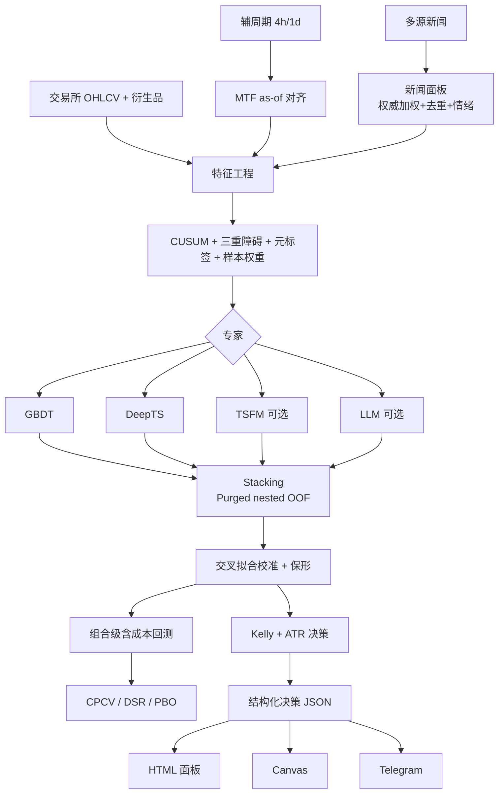

# Crypto-Alpha 系统架构、技术实现与使用说明

> **BTC / ETH** 做多·做空**概率 + 止损/止盈 + 建议仓位**的多专家集成预测系统。  
> 本文基于当前仓库源码（`src/crypto_alpha/`、`config/config.yaml`、`scripts/`）撰写，说明**架构设计、实现细节与完整用法**。  
> ⚠️ 仅供研究学习。金融市场可预测边际小且不稳定；任何结果须经 CPCV/PBO 与纸面交易验证后，才可考虑极小资金实盘。

---

## 目录

1. [设计哲学](#1-设计哲学)
2. [系统总览与数据流](#2-系统总览与数据流)
3. [目录结构](#3-目录结构)
4. [数据层](#4-数据层)
5. [特征层](#5-特征层)
6. [标注层（三重障碍 + 元标签）](#6-标注层)
7. [验证层（Purged CV / CPCV / DSR / PBO）](#7-验证层)
8. [专家层](#8-专家层)
9. [集成层（Stacking）](#9-集成层)
10. [校准层](#10-校准层)
11. [回测层](#11-回测层)
12. [风控与决策层](#12-风控与决策层)
13. [服务与交付层](#13-服务与交付层)
14. [配置全解（config.yaml）](#14-配置全解)
15. [端到端调用链](#15-端到端调用链)
16. [使用说明](#16-使用说明)
17. [脚本索引](#17-脚本索引)
18. [测试](#18-测试)
19. [防泄漏与防过拟合检查表](#19-防泄漏与防过拟合检查表)
20. [扩展指南](#20-扩展指南)
21. [已知局限与路线图](#21-已知局限与路线图)
22. [术语表](#22-术语表)

---

## 1. 设计哲学

系统围绕四条铁律设计：

| 铁律 | 含义 | 落地 |
|------|------|------|
| **无泄漏** | 任意时刻只能用当时可得信息 | 因果特征、MTF as-of、新闻 buffer、Purged+Embargo、nested OOF、交叉拟合校准 |
| **无过拟合** | 回测好看不等于可交易 | CPCV 多路径、DSR、PBO、弱专家剪枝、样本唯一性权重 |
| **概率化 + 风控** | 输出可下注的概率，而非硬涨跌 | 元标签二分类 → 校准 → 保形弃权 → 半 Kelly + ATR 障碍 |
| **优雅降级** | 缺网/缺 GPU/缺依赖仍能跑主干 | 合成行情兜底、TSFM→naive、专家探测跳过、衍生品 NaN |

**核心范式（AFML 元标签）**——不是直接猜「下一根涨跌」：

1. 简单主策略给出方向 `side ∈ {+1,-1}`（动量 / 均值回归）  
2. **三重障碍**判定该方向在止盈 / 止损 / 超时下是否盈利 → 元标签 `bin ∈ {0,1}`  
3. 多专家学习「该不该执行 + 盈利概率」  
4. 概率校准 + 保形：不自信则 HOLD  
5. 分数 Kelly 定仓；止损/止盈与标注共用 `pt_sl × ATR`

---

## 2. 系统总览与数据流



**默认启用专家**：`gbdt` + `deep_ts`（可在本机 CPU/小卡完成）。`tsfm` / `llm` 可插拔。

---

## 3. 目录结构

```
cryptoCurrency/
├── config/config.yaml              # 唯一参数入口
├── docs/ARCHITECTURE.md            # 本文档
├── scripts/
│   ├── _bootstrap.py               # 注入 src/ 到 sys.path
│   ├── 01_fetch_data.py … 12_audit.py
│   └── train_llm_qlora.py          # LLM 唯一独立训练入口
├── src/crypto_alpha/
│   ├── config.py
│   ├── data/          fetch / storage / news / sentiment
│   ├── features/      technical / frac_diff / mtf / news_features / build
│   ├── labeling/      triple_barrier / meta_labeling / sample_weights
│   ├── validation/    purged_kfold / cpcv
│   ├── experts/       gbdt / deep_ts / tsfm / llm / base
│   ├── ensemble/      stacking.py
│   ├── calibration/   calibrate.py
│   ├── backtest/      engine.py
│   ├── risk/          sizing.py
│   ├── diagnostics/   integrity.py    # 闭环完整性诊断
│   ├── serve/         service.py / notifier.py
│   └── pipeline/      run.py / evaluate.py / report.py
├── tests/             smoke / leakage / design_fixes / mtf / pipeline_integrity
├── data/              运行时 raw / features / news / news_raw
└── artifacts/         模型 / 汇总 / 面板 / adapter
```

包安装布局：`pyproject.toml` 中 `where = ["src"]`，导入名为 `crypto_alpha`。

---

## 4. 数据层

### 4.1 数据获取流程（无需预先准备数据集）

**数据源接口已内置**：行情/衍生品走 `ccxt`，新闻走多源适配器（RSS/API）。**你不需要手工准备任何 CSV/数据集**——跑训练时会自动拉取、缓存、加工成建模结构、再训练。

触发点在 `pipeline/run.prepare_dataset`：`load_symbol_data`（拉行情/缓存/合成）→ `build_feature_matrix`（特征）→ `build_meta_labels`（标签）→ 组装 `Dataset`（`panel/X/y/events/t1/sample_weight`），`train_and_validate` 直接吃这个结构。

| 用法 | 命令 | 说明 |
|------|------|------|
| **全自动（推荐）** | `python scripts/04_train_and_backtest.py` | 内部自动拉数→特征→标注→训练→回测→决策；首次拉多年历史较慢，之后走缓存+增量 |
| 分步（想先查数据） | `01_fetch_data.py` → `08_fetch_news.py` → `02_build_features.py` → `03_label.py` → `04_…` | `01/02` 只是提前落盘方便检查，**非训练前置必需** |

**降级与透明度（重要）**：

- 真实拉取需装 `ccxt` 且有网络；主周期拉取失败时，若 `data.allow_synthetic_fallback: true`（默认）会 **warn 后降级合成**，并在 `DataFrame.attrs["data_source"]=synthetic_fallback` / `Dataset.data_source` / 看板 `data_mode` 中显式标记为「合成(降级)」——**不再只看配置就标「真实」**。
- 设 `allow_synthetic_fallback: false` 可在断网时直接失败，避免误用模拟盘写研究报告。
- 衍生品/部分新闻源缺 API key 或断网时**自动跳过**（对应特征为 NaN/0），不阻断主流程。
- TSFM 回退 naive、专家探测跳过等会写入 `degradations` 元数据，避免名实不符。

### 4.2 行情（`data/fetch.py`）

| API | 作用 |
|-----|------|
| `fetch_ohlcv` | ccxt 分页拉取多年 K 线（单次 limit≈1000，循环至 `since`→今） |
| `fetch_derivatives` | 资金费率 / OI；**分页** `_paginate_funding` / `_paginate_oi`（`max_pages=500`）；失败→NaN 列 |
| `generate_synthetic_ohlcv` | GARCH 味 + regime 合成行情（CI / 离线） |
| `load_symbol_data(cfg, symbol, timeframe=None)` | 统一入口：合成 / 缓存 / 增量 / 降级 |
| `load_aux_timeframes` | 加载辅周期字典 `{tf: df}` |
| `resample_ohlcv` | 合成模式下由主周期重采样辅周期（价格路径一致） |

**缓存约定**

- 主周期：`data/raw/<SYMBOL>.parquet`（例：`BTC_USDT.parquet`）  
- 辅周期：`data/raw/<SYMBOL>__4h.parquet`  
- `cache: true` + `incremental_update: true`：只拉最后一根之后的新 bar  

**当前默认**

- `use_synthetic: false`（研究/实盘默认真实数据）  
- 主周期失败拉数会 **warn 后降级合成**（辅周期失败则跳过，不拖垮主流程）  
- 冒烟测试在代码里显式打开合成，勿依赖默认值做离线演示  

### 4.3 新闻（`data/news.py`）与情绪（`data/sentiment.py`）

**优先级**：`use_history` 历史库 → `use_synthetic` 合成 → 实时 `sources`。

| 机制 | 说明 |
|------|------|
| 权威分层 | `tier_weights`（SEC=1 …）加权情绪与摘要 |
| 去重互证 | 时间窗内 Jaccard 归并，抬高 `corroboration` |
| 桶末 + buffer | 桶时间 + `buffer_minutes` 后才可用 → `merge_asof(backward)` |
| **合成新闻守卫** | `data.use_synthetic=false` 且 `news.use_synthetic=true` → **ValueError**（合成情绪由未来收益构造） |
| 词典整词匹配 | `lexicon` 后端用**词边界**匹配 ASCII 关键词，避免 "against" 误命中 "gain"、"banks" 误命中 "ban" 等子串误判；短语/中文仍用子串 |
| LLM 提示 TTL | `align_news_asof` 支持 `ttl_hours`：超期新闻置空，避免 `ffill` 把几天前旧新闻当"最近新闻"持续塞进 prompt（与数值特征 `feature_ttl_hours` 口径一致） |

情绪后端：`lexicon`（默认）/ `cryptobert` / `finbert` / `chinese` / `multilingual`。

历史回填：`scripts/09_backfill_news.py` → `data/news_raw/`，再设 `news.use_history: true`。

---

## 5. 特征层

### 5.1 装配（`features/build.py`）

```
OHLCV(+衍生品)
  → add_technical_features   # RSI/MACD/ATR/rv/布林/资金费率衍生等
  → frac_diff_ffd(log price) # 分数阶差分，平稳且保留记忆
  → add_mtf_features         # 若 mtf_enabled
  → (pipeline 内) add_news_features
```

`feature_columns` 排除**非平稳绝对量**：`open/high/low/close/volume/open_interest/funding_rate` 及 `atr_14`。

**平稳性纪律（重要）**：所有进模型的特征都保持尺度无关。
- `macd/macd_signal/macd_hist`（主面板与各辅周期 `tf*_macd_hist`）均**除以 close 归一化**，避免多年价格量级漂移（如 BTC 1万→6万）导致的分布漂移与跨 regime 泛化退化。
- `atr_14` 为**绝对**价格量纲，仅供标注（`_barrier_target`）与实盘 `decide` 计算止损距离；建模改用相对版本 `atr_norm = atr_14 / close`，并把 `atr_14` 从 `feature_columns` 排除。

### 5.2 多周期 MTF（方案 B，`features/mtf.py`）

**不做**「每个周期各训一套模型」。主周期（默认 `1h`）负责事件、标注、训练索引；辅周期（`4h`/`1d`）只提供**已收盘**高周期上下文。

**防泄漏铁律**（K 线时间戳 = 开盘时刻）：

- 辅 bar 开盘 `u`、周期 `Δ_aux` → **可用时刻** `u + Δ_aux`  
- 主 bar 开盘 `t`、周期 `Δ_main` → **决策时刻** `t + Δ_main`  
- 对齐：`merge_asof(backward)`，要求可用时刻 ≤ 决策时刻  

辅特征示例：`tf4h_ret_*`、`tf4h_rsi_*`、`tf4h_vol_*`、`tf4h_macd_hist`、`tf4h_atr_norm`、`tf4h_trend`；可选 `mtf_confluence`。

配置：`mtf_enabled: true`，`mtf_lookbacks: [1,3,7]` 等。

### 5.3 新闻数值特征（`features/news_features.py`）

不只喂 LLM：情绪 / 互证 / 条数 / 权威度经 TTL、半衰期衰减、EMA 后并入**所有专家**共享面板。

- **决策时刻与 MTF 对齐**：`merge_asof` 左键为 `open + Δ_main`（该 bar 收盘才决策），不再用开盘时刻，避免少用已合法可用的新闻。
- **TTL 无旁路**：过期时 `news_sentiment_raw` 等**全部**数值列归零（含 raw）。

---

## 6. 标注层

### 6.1 主信号（`labeling/meta_labeling.py`）

- `momentum`：近 `primary_lookback` 收益符号 → side  
- `meanrev`：相对均线反向 → side  

### 6.2 障碍波动（与实盘统一）

| `barrier_vol` | 含义 |
|---------------|------|
| **`atr`（默认）** | `trgt = atr_14 / close`（相对 ATR），与 `decide` 的 ATR 倍数一致 |
| `rv` | 已实现对数收益波动（旧口径，可回退） |

`pt_sl: [1.5, 1.5]`：价格空间止盈/止损与 `decide` **同一加性公式**（`trgt=atr/close` 时 `atr_abs≈trgt×entry`）：

- 多头：`TP = entry(1+pt·trgt)`，`SL = entry(1-sl·trgt)`
- 空头：`TP = entry(1-pt·trgt)`，`SL = entry(1+sl·trgt)`（即 `entry ± side×mult×atr`）

触碰用 **价格空间 high/low** 判定；`get_bins` 再把触及价映射为持仓对数收益（多头 `log1p(±·)`，空头 `-log1p(∓·)`）。**不再**对空头做对数对称翻转（旧实现会得到几何价 `entry/(1±x)`，与挂单不一致）。

### 6.3 三重障碍（`labeling/triple_barrier.py`）

1. `cusum_filter`：累计偏移超**因果扩展中位数**阈值才采样（`causal_cusum_threshold`）。冷启动仅 `ffill` + **固定先验**（默认 0.5%），**禁止** `bfill` / 全样本 `nanmedian` 前视；事件过少 `< min_cusum_events` 则退回全量，并标记 `cusum_full_sampling`  
2. 上障碍（止盈）/ 下障碍（止损）/ 垂直障碍（`vertical_barrier_bars`，默认 24 根 1h ≈ 1 天）  
3. 触碰判定用 **bar 内 high/low**（加性价格障碍，多空与 `decide` 对齐）；同 bar 平局 **悲观判止损**  
4. 入场价 = 事件 bar(t0) 的收盘价，**触碰扫描从 t0 的下一根 bar 开始**  
5. **无法满足垂直持有期的事件直接丢弃**（不再用最后一根 bar 截断打标）  
6. `get_bins` → `ret`, `bin`, `side`, `t1`, `bars_held`  
7. **训练↔实盘对齐**：`serve_require_cusum: true`（默认）时，`latest_decision` / `decide_live` 仅在 CUSUM 事件 bar 上开仓，否则 HOLD；全量回退时自动放宽

### 6.4 样本权重（`labeling/sample_weights.py`）

- 平均唯一性（重叠标签降权）× `|ret|` × 时间衰减  
- `prepare_dataset` 中归一化到均值 1，传入专家与元学习器  

---

## 7. 验证层

### 7.1 Purged K-Fold（`validation/purged_kfold.py`）

训练集剔除与测试段标签区间重叠的样本，并加 `embargo_pct` 禁运带（**clamp 到样本末尾**，近末折不得整段跳过禁运）。  
用于：一层专家 OOF、二层元学习器 nested OOF、交叉拟合校准/保形。

### 7.2 CPCV（`validation/cpcv.py` + `pipeline/evaluate.py`）

- `CombinatorialPurgedCV(N=6, k=2)` → **C(N,k) 个测试组合**各自训练/回测（`evaluation_unit=combo`）  
- **不是**拼接后的 φ 条完整路径；`n_paths_theoretical=φ` 仅供参考，`n_combos` / 兼容字段 `n_paths` 现等于组合数  
- 组合内：训练折 OOF 拟合校准器 + **OOF 拟合保形**（单专家与集成分支一致，禁用训练集内概率拟合保形）→ 测试折回测  
- 输出：组合夏普分布、**DSR**、**PBO**、`caveats`  
- DSR 用**经验偏度/峰度**（字段 `dsr_skew` / `dsr_kurt`）  
- 默认不随 `10_run_all` 开启，需 `--cpcv`  
- 含 `pseudo_oof` 专家时，`caveats` 会标明单专家列非折内重训；stacking 默认已排除其出 meta  

**统计力告警（`cpcv_report` 输出 `caveats` 字段，务必阅读）**：

- 评估单元是**相关组合**而非独立完整路径 → DSR **偏乐观**，只宜作相对参考。  
- `dsr_n_trials` 须按你真实试过的策略/超参次数**如实填写**。  
- PBO 默认配置数 &lt; 8 时 `pbo_warning` 为真。

---

## 8. 专家层

统一接口：`experts/base.BaseExpert` → `fit` / `predict_proba` / `clone` / `set_panel`。  
注册表：`EXPERT_REGISTRY`（`experts/__init__.py`）。

### 8.1 对照表

| 专家 | 文件 | 训练发生位置 | 本机可训？ | 大显卡？ |
|------|------|--------------|------------|----------|
| **GBDT** | `gbdt.py` | 流水线内 LightGBM | ✅ CPU | 否 |
| **DeepTS** | `deep_ts.py` | 流水线内小 PatchTST | ✅ CPU/小卡 | 否 |
| **TSFM** | `tsfm.py` | 冻结 Chronos + 训浅头 | ✅（可 CPU） | 否（可选加速） |
| **LLM** | `llm.py` | **`fit` 只加载**；SFT 在 `train_llm_qlora.py` | ❌（数据可本机构造） | **需要** |

**伪 OOF 护栏**：`BaseExpert.pseudo_oof=True`（当前仅 LLM）表示无法折内重训。`StackingEnsemble` 默认 `exclude_pseudo_oof_from_meta: true`：**不把该类专家分数喂给元学习器**（避免污染 nested OOF / 回测 / 校准），仅写入 `pseudo_oof_` + `degradations`（`*:excluded_from_meta_pseudo_oof` / `*:pseudo_oof_not_cross_validated`）供诊断。若 `enabled` 全是伪 OOF，将报错并要求至少启用一个可折内重训专家。

### 8.2 GBDT（压舱石）

表格非线性交互；`sample_weight`；**显式 `side` 特征**（与主信号一致，由 `prepare_dataset` 写入面板并入 `feature_cols`）；`n_estimators=400` 等见配置。最稳基线。

### 8.3 DeepTS

- 每个事件回看 `lookback=64` 根主周期特征窗（含面板上的 `side` 通道）  
- `BCEWithLogitsLoss` 加权；**时间切分** `val_frac` + `early_stop_patience`  
- `device: auto`；无 torch → 探测阶段跳过  

### 8.4 TSFM

- 后端：`chronos` / `timesfm` / `naive`  
- Chronos **不微调**，只出预测分；新闻经**协变量融合头**（logistic/GBDT）  
- **TimesFM**：`_timesfm_forecast` 仍为 `NotImplementedError`；缺包时回退 naive；即便 `backend=timesfm` 且包已安装，前向未实现也会在运行期**捕获并回退 naive**（不再崩溃）  

### 8.5 LLM（Qwen + QLoRA）

- 默认模型：`Qwen/Qwen2.5-32B-Instruct`，`load_in_4bit: true`  
- Verbalizer：只答 `1`/`0`，取 token softmax 得 `P(盈利)`  
- 新闻 as-of 对齐后写入 prompt  
- 训练：`python scripts/train_llm_qlora.py`（可 `--dry-run` 只造数据）  
- 产物：`artifacts/qwen_qlora_adapter`；推理需 CUDA + adapter  
- **`pseudo_oof=True`**：流水线内不折内重训；默认**不进入** stacking 元学习器（见 §8 护栏 / §9）  

---

## 9. 集成层（`ensemble/stacking.py`）

1. **一层 OOF**：可折内重训的专家在 PurgedKFold 上出干净概率；`pseudo_oof` 专家只冻结推理一次并记 degradations  
2. **伪 OOF 护栏**：默认 `exclude_pseudo_oof_from_meta: true`，将其排除出元学习器（分数保留在 `pseudo_oof_`）  
3. **弱专家剪枝**：仅用时间上**较早一半**真 OOF 的 AUC 做选型（避免 selection-on-evaluation），再在完整 OOF 上训元学习器；AUC &lt; `min_expert_auc` 剔除（至少留 1 个）  
4. **二层 nested OOF**：元学习器再交叉拟合 → `meta_oof_`（评估/回测用，无「自训自评」）  
5. **部署**：全量 OOF 拟合 `meta_` + 各（进入 meta 的）专家全量重训  

默认元学习器：`logistic`（`C=1.0`）；可选 `gbdt`。

样本过少无法做二层 nested CV 时，退回同批 fit+predict（评估偏乐观），并 **warn + 写入 `degradations`**（`meta_nested_oof_fallback_insample`）。

**解释边界**：Purged K-Fold / CPCV 的 OOF **不是** walk-forward 实盘滚动再训练曲线；净化防标签重叠，不保证「只用过去训未来」。上线前应另做滚动评估，勿把单次 OOF 夏普直接当可部署证明。

---

## 10. 校准层（`calibration/calibrate.py`）

| 组件 | 作用 |
|------|------|
| `ProbabilityCalibrator` | Isotonic / Platt，让「说 70%」接近经验频率 |
| `cross_fitted_calibrated` | 评估/回测用的**无泄漏**校准概率 |
| `cross_fitted_conformal_flags` | 评估/回测用的**交叉拟合**保形弃权旗标 |
| `fit_deploy_calibrator_and_conformal` | 部署：时间切分，较早 OOF 拟合校准器、较晚 `conformal_frac` 拟合保形器（同基且独立分割） |
| `ConformalBinary` | 预测集恰好一类才 `confident`；否则强制 HOLD |

**校准基 + 独立保形集**：实盘 `decide` 用部署 `cal`；保形在 `cal` 变换后的**持出** OOF 上拟合。回测则用交叉拟合的 `oof_cal` + `confident` 掩码，与实盘 HOLD 口径对齐。

交叉拟合校准样本过少、退回同批 OOF fit+transform 时，**warn + 写入 `degradations`**（`calib_cross_fit_fallback_insample`），与二层 meta 小样本回退同一透明度纪律。

配置：`method: isotonic`，`conformal_alpha: 0.1`，`calib_splits: 5`，`conformal_frac: 0.3`。

---

## 11. 回测层（`backtest/engine.py`）

### 11.1 组合级（默认，`portfolio_mode: true`）

- 重叠事件**共享权益池**：开仓锁定仓位，平仓释放  
- 单笔 ≤ `max_position_pct`，合计 ≤ `max_gross_exposure`  
- 可用资金不足（&lt; `min_position_pct`）→ 跳过（`n_skipped_capacity`）  
- **加性记账**：`Δequity = entry_equity × pnl_frac`，避免重叠仓乘积复利虚高；`pnl` 列为相对入场权益的分数贡献，`entry_equity` 列供对账  
- 可选 `confident` 掩码：保形弃权与实盘 HOLD 对齐  
- 成本：开平各一次 fee+slip；资金费 ≈ `funding_bps_per_bar × bars_held`（默认资金费为 0）  
- **盯市（mark-to-market）**：传入 `prices` 且含 `side` 时，按入场权益计浮动盈亏，供 MDD / 日内熔断。浮动不按障碍价封顶（指示性）。  

### 11.2 独立复利（`portfolio_mode: false`）

旧口径，**会高估收益、低估回撤**，仅作对照。

指标：每笔 Sharpe、**年化 Sharpe（按平均唯一性折算）**、MDD（盯市优先）、`max_drawdown_realized`、`avg_uniqueness`、`n_trades_effective`、Calmar、胜率；另有 `deflated_sharpe_ratio`、`probability_of_backtest_overfitting`。

DSR：方差项在开方前 **clamp ≥ 0**（极端偏度/夏普下公式括号可为负）；clamp 后标准差为 0 则返回 `nan`，避免污染报告。

---

## 12. 风控与决策层（`risk/sizing.py`）

```
decide(prob, side, entry, atr, risk_cfg, pt_sl=..., fee=..., slip=...)
  → HOLD / LONG / SHORT
  → win_probability, suggested_position_pct
  → stop_loss = entry - side × sl_mult × atr
  → take_profit = entry + side × pt_mult × atr
```

- Kelly：`f* = (p(b+1)-1-cost)/b`，再乘 `kelly_fraction`（默认半 Kelly 0.5），封顶 `max_position_pct`  
  - **成本解析**（`resolve_roundtrip_cost`，回测与 `decide` 共用）：`risk.roundtrip_cost_frac` 为 **null/缺失** 时回退 `2*(fee+slip)`；显式数值则用之。YAML `null` 会使键存在，**不能**靠 `dict.setdefault` 覆盖。  
  - ⚠️ **口径说明**：把 `f*` 当作**名义仓位比例**的**置信度→仓位启发式**（`sizing_note=confidence_to_position_heuristic`），不是 growth-optimal 连续 Kelly。  
- `pt_sl` 与 `labeling.pt_sl` 对齐（多空加性障碍同一公式）；决策 JSON 含 `execution_assumption`（默认 `close_fill`：当根收盘特征+收盘成交，研究常用；实盘通常更接近下一根开盘）  
- HOLD 时 **不输出** 止损止盈字段  

`latest_decision` / `decide_live`：最新特征完整 bar + 保形弃权 +（默认）CUSUM 事件门控；每轮刷新 LLM `set_news`；传入 `fee`/`slip` 供成本回退。

---

## 13. 服务与交付层

| 能力 | 实现 |
|------|------|
| 实时循环 | `DecisionService.run_forever`：轮询 `poll_seconds`，每 `retrain_every_cycles` 重训 |
| 播报 | Telegram（env token/chat）或控制台；HOLD 默认可关；同信号去重 |
| HTML 面板 | `10_run_all` → `artifacts/dashboard.html` + `run_all_summary.json` |
| Cursor Canvas | `11_make_canvas` → 托管 `canvases/*.canvas.tsx` |
| 专家探测 | `probe_experts`：缺依赖则跳过并记录原因；**不永久污染** `config.experts.enabled` |

---

## 14. 配置全解（config.yaml）

所有脚本只读 `config/config.yaml`（经 `Config.load()`）。

| 段 | 关键当前默认 | 说明 |
|----|--------------|------|
| `project` | seed=42 | 数据/产物目录 |
| `data` | `use_synthetic=false`，`allow_synthetic_fallback=true`，1h+4h/1d | 真实优先；降级可追踪 |
| `news` | `use_synthetic=false`，`as_feature=true`；history 默认真实源 | 禁止仅 synthetic 历史混真实行情 |
| `features` | FFD d=0.4，`mtf_enabled=true` | MTF 方案 B |
| `labeling` | ATR 障碍，`serve_require_cusum=true` | 与 decide / 实盘事件对齐 |
| `validation` | N=6,k=2，embargo=1%，`dsr_n_trials=50` | CPCV 组合评估 |
| `experts` | **enabled=[gbdt, deep_ts]** | tsfm/llm 可选 |
| `ensemble` | logistic，`min_expert_auc=0.5`，`exclude_pseudo_oof_from_meta=true` | 半窗选型；伪 OOF 不进 meta |
| `calibration` | isotonic，α=0.1，`conformal_frac=0.3` | 独立保形集；交叉拟合失败记 degradations |
| `backtest` | **`portfolio_mode=true`**，阈值 0.55 | 组合加性记账 |
| `risk` | 半 Kelly 启发式，日熔断 5%，`execution_assumption=close_fill` | |
| `serve` | 3600s 轮询，24 周期重训 | Telegram 默认关 |

改任何超参后重跑对应脚本即可；随机性由 `project.random_seed` + `set_global_seed` 控制。合成数据/合成新闻的按币种偏移用 `hashlib`（`stable_symbol_offset`）派生，**跨进程/机器确定**——不再用带随机盐的内置 `hash()`，保证同 seed 的合成结果可复现。

---

## 15. 端到端调用链

```
Config.load()
  → load_symbol_data / load_aux_timeframes          # data/fetch.py
  → build_feature_matrix(..., symbol=...)         # features/build.py + mtf
  → add_news_features                               # features/news_features.py
  → build_meta_labels                               # labeling/*
  → panel["side"]=primary_signal → feature_cols      # 元标签方向进 GBDT/DeepTS
  → sample_weights                                  # labeling/sample_weights.py
  → prepare_dataset → Dataset                       # pipeline/run.py
  → build_experts → StackingEnsemble.fit            # experts + ensemble
  → cross_fitted_calibrated + Calibrator + Conformal
  → backtest_events                                 # backtest/engine.py
  → latest_decision / decide_live                   # risk/sizing.py
```

库级入口：

| 函数 | 文件 | 作用 |
|------|------|------|
| `prepare_dataset` | `pipeline/run.py` | 数据→特征→标签→权重 |
| `train_and_validate` | 同上 | 集成+校准+回测 |
| `latest_decision` | 同上 | 最新 bar 决策 |
| `cpcv_report` | `pipeline/evaluate.py` | CPCV/DSR/PBO |
| `run_all` / `build_dashboard` | `pipeline/report.py` | 联跑 + HTML |

---

## 16. 使用说明

### 16.1 安装

```powershell
# 最小（GBDT + 集成 + 回测）
pip install -e .

# 深度时序
pip install torch   # 按本机 CUDA 选择官方 index

# 按需
pip install -e ".[data]"   # ccxt 真实行情
pip install -e ".[tsfm]"   # Chronos
pip install -e ".[llm]"    # QLoRA 依赖
```

### 16.2 离线冒烟（强制合成）

```powershell
python tests/test_smoke.py
# 或临时改 config: data.use_synthetic / news.use_synthetic = true（二者须同开）
```

### 16.3 推荐研究流程（真实数据）

```powershell
# 1. 确认 config: use_synthetic=false；可选 news.use_history=true
pip install -e ".[data]"

# 2. 拉行情（主+辅周期缓存）
python scripts/01_fetch_data.py

# 3. （可选）历史新闻
python scripts/09_backfill_news.py --providers cryptocompare gdelt
# 然后 config: news.use_history: true

# 4. 特征 / 标注检查
python scripts/02_build_features.py
python scripts/03_label.py

# 5. （建议）训练前先跑闭环完整性体检，全 PASS 再训练
python scripts/12_audit.py

# 6. 训练 + 组合回测 + 决策
python scripts/04_train_and_backtest.py

# 7. 发布前严谨评估
python scripts/05_cpcv_report.py
# 或
python scripts/10_run_all.py --cpcv --open

# 8. 交互面板
python scripts/11_make_canvas.py
```

### 16.4 一键联跑

```powershell
python scripts/10_run_all.py
python scripts/10_run_all.py --cpcv --open
python scripts/10_run_all.py --experts gbdt deep_ts
python scripts/10_run_all.py --symbols BTC/USDT
```

产出：`artifacts/dashboard.html`、`artifacts/run_all_summary.json`。

### 16.5 实时服务

```powershell
python scripts/07_serve.py --once    # 训一次 + 决策一轮
python scripts/07_serve.py --loop    # 常驻轮询 + 周期重训
```

Telegram：`serve.telegram.enabled: true`，并设置环境变量 `TELEGRAM_BOT_TOKEN`、`TELEGRAM_CHAT_ID`。

### 16.6 决策长什么样

系统输出**结构化决策**（非聊天问答），例如：

```json
{
  "symbol": "BTC/USDT",
  "timestamp": "2026-07-17 12:00:00+00:00",
  "signal": "LONG",
  "win_probability": 0.63,
  "entry_price": 65000.0,
  "suggested_position_pct": 0.12,
  "stop_loss": 64100.0,
  "take_profit": 65900.0,
  "atr": 600.0,
  "confident": true
}
```

`signal ∈ {LONG, SHORT, HOLD}`；不自信或概率低于阈值时为 HOLD。

### 16.7 LLM 单独训练（可选）

```powershell
python scripts/train_llm_qlora.py --dry-run   # 只构造 SFT 样本
python scripts/train_llm_qlora.py             # 需大显存 GPU
# 完成后 experts.enabled 加入 "llm"，保证 adapter_path 存在
```

### 16.8 本机 vs 租卡（训练分工）

| 任务 | 本机 | 租大卡 |
|------|------|--------|
| GBDT / DeepTS / Stacking / 校准 / 回测 | ✅ | 不需要 |
| TSFM 浅头 + Chronos 推理 | ✅ | 可选加速 |
| LLM QLoRA | 造数据可以 | **训练/大模型推理需要** |

---

## 17. 脚本索引

| 脚本 | 作用 | 常用参数 |
|------|------|----------|
| `01_fetch_data.py` | 拉主+辅周期并缓存 | — |
| `02_build_features.py` | 特征（含 MTF+新闻）落盘 | — |
| `03_label.py` | 打印标签分布 | — |
| `04_train_and_backtest.py` | 训练+报告+回测+决策+净值图 | — |
| `05_cpcv_report.py` | CPCV / DSR / PBO | — |
| `06_decide.py` | 单次最新决策 JSON | — |
| `07_serve.py` | 实时服务 | `--once` / `--loop` |
| `08_fetch_news.py` | 建新闻面板 | — |
| `09_backfill_news.py` | 历史新闻回填 | `--start` `--end` `--providers` |
| `10_run_all.py` | 全专家联跑 + HTML | `--experts` `--symbols` `--cpcv` `--open` |
| `11_make_canvas.py` | Cursor Canvas | `--out` |
| `12_audit.py` | 闭环完整性在线体检（CPU，无显卡） | `--json` `--bars` `--seed` |
| `train_llm_qlora.py` | LLM QLoRA SFT | `--dry-run` |

全部脚本通过 `_bootstrap` 将 `src/` 加入路径。

---

## 18. 测试

```powershell
pytest -q
# 或分文件
pytest -q tests/test_smoke.py tests/test_leakage.py tests/test_design_fixes.py tests/test_mtf.py tests/test_pipeline_integrity.py
```

| 文件 | 覆盖 |
|------|------|
| `test_smoke.py` | 合成 + 仅 GBDT 全链路 |
| `test_leakage.py` | 新闻 as-of、Purged 无重叠、合成新闻守卫、盘中止损 |
| `test_design_fixes.py` | pt_sl 止盈止损、ATR 障碍、组合敞口、空头加性对齐、CUSUM 无前视、null 成本、DSR clamp、小样本 stacking 降级 |
| `test_mtf.py` | 辅周期无前视、拒绝更细周期、特征含 MTF |
| `test_pipeline_integrity.py` | 闭环完整性闸门（见 18.1） |

### 18.1 闭环完整性诊断（`diagnostics/integrity.py`）

回答"**标注/回测/验证闭环的代码逻辑是否严谨**"，全部 CPU 秒级、仅用轻量 GBDT、
不依赖显卡。既作离线单测（`tests/test_pipeline_integrity.py`），也作在线体检
（`python scripts/12_audit.py [--json]`，有 FAIL 时退出码非零，可接 CI）。

| 层 | 检查 | 意义（挂了说明哪里坏） |
|----|------|------|
| 标注 oracle | 人工构造价格 → 三重障碍唯一确定结果（止盈/止损/同 bar 平局判损/垂直到期/做空对称）；**现已纳入在线 `12_audit`**（此前仅 pytest） | 标注函数方向、平局、到期口径 |
| CV 不变量 | PurgedKFold / CPCV 训练×测试标签区间**零重叠**、禁运有间隔 | 净化/禁运是否真生效 |
| 空对照(AUC) | 纯随机游走喂满全链路 → OOF AUC ≈ 0.5 | 特征/标注是否制造假信号 |
| 空对照(收益) | **多种子**随机游走 → 回测收益**均值 ≤ 阈值**（成本下应 ≈0/为负；单次幸运不计） | 回测/决策层是否在无信号下凭空造利润 |
| 置换基线 | 打乱标签重训 → AUC 塌回 ≈ 0.5 | 堆叠/校准/回测是否偷看测试集 |
| 正对照 | "仅含过去信息即可预测"的构造数据 → AUC 明显 > 0.5 | 排除"永远随机"的假阴性 |
| 时移不变 | 整体平移时间戳 → OOF 逐位相等 | 逻辑是否误依赖绝对时间 |
| 回测对账 | 末端权益 = 逐笔 pnl 累计复利；并发敞口 ≤ 上限；成本单调；组合 ≤ 独立复利 | 回测记账/资金占用/成本口径 |
| 复现性 | 同 seed 两次训练 OOF 完全一致 | 随机性是否被固定 |

用法：正式训练前先 `python scripts/12_audit.py`，全 PASS 再跑 `04_train_and_backtest.py`（当前 **20 项** 全 PASS）。

---

## 19. 防泄漏与防过拟合检查表

**防泄漏**

- [x] 技术指标 / FFD 严格因果  
- [x] MTF：辅 bar 可用时刻 ≤ 主决策时刻（`tests/test_mtf.py`）  
- [x] 新闻：桶末 + buffer + **决策时刻 as-of**；TTL 含 raw；合成/仅 synthetic 历史守卫  
- [x] Purged + Embargo（含近末折 clamp）；二层 nested OOF  
- [x] 交叉拟合校准 + 交叉拟合保形；部署校准/保形时间切分  
- [x] 三重障碍 high/low、下一根扫描；**多空**加性价格障碍与 `decide` 对齐；CUSUM 因果阈值（固定先验冷启动，无 bfill/全样本中位数）  
- [x] 建模特征尺度无关；训练/实盘 CUSUM 事件对齐  

**防过拟合**

- [~] CPCV（需 `--cpcv`）；**组合**内已校准+保形（非完整路径重建）  
- [~] DSR / PBO（见 `caveats`；PBO 默认配置少；DSR 方差项已 clamp）  
- [x] 样本权重；弱专家**半窗选型**剪枝；保形弃权；小样本二层 OOF / 校准交叉拟合回退记入 `degradations`  
- [x] 伪 OOF（LLM）默认排除出元学习器；元标签 `side` 进入 GBDT/DeepTS 特征  
- [~] OOF/CPCV ≠ walk-forward（解释边界，见 §9 / §21）  

**回测真实性**

- [x] 默认组合级 + **入场名义加性记账**  
- [x] 回测接入保形 `confident` 掩码  
- [x] 标签与 decide 共用 ATR × `pt_sl`（多空加性；Kelly 成本 `null→2*(fee+slip)` 回测/实盘一致）  
- [x] 盯市 MDD/日内熔断；年化夏普按唯一性折算  
- [x] `data_source` / 看板 `data_mode` 反映真实或降级合成  
- [~] 资金费默认 0；跨币种仍分账户；执行假设默认 `close_fill`  

---

## 20. 扩展指南

- **加专家**：继承 `BaseExpert`，实现 `fit/predict_proba/clone`，写入 `EXPERT_REGISTRY`，配置 `experts.enabled` 加名。  
- **加新闻源**：`news.sources` 增条目，或在 `news.py` 加适配器（统一 schema）。  
- **改标注**：调 `labeling.pt_sl` / `vertical_barrier_bars` / `primary_signal` / `barrier_vol`。  
- **关 MTF**：`features.mtf_enabled: false`。  
- **TSFM 协变量**：`experts.tsfm.covariate_cols`（`auto` = 新闻数值列）。  

---

## 21. 已知局限与路线图

| 局限 | 现状 | 建议优先级 |
|------|------|------------|
| 真实数据依赖网络 | 失败可降级，但 **`data_source`/看板会标「合成(降级)」**；可关 `allow_synthetic_fallback` | ★★★ 预拉缓存 + 新闻历史库 |
| TimesFM | 前向未实现 → 回退 naive 且 **`degraded=True`** 写入元数据 | ★★ 实现原生 forecast 或固定 chronos/naive |
| TSFM 未真微调 | 冻结预测 + 浅头 | ★★ 监督微调或显式基线 |
| LLM | 独立脚本 + 大显存；实盘每轮刷新 `set_news` | ★ 有文本 alpha 时再开 |
| 跨币种组合 | 单币组合化；BTC+ETH 分账户 | ★ 统一权益池 |
| CPCV 默认关 | 有代码；评估单元为**组合**非完整路径 | ★★★ 上线前必跑；★★ 真路径重建 |
| Stacking 二阶泄漏 | nested OOF 一层特征仍非 full-nested（影响很小）；小样本二层/校准回退已 warn+`degradations`；LLM 伪 OOF 默认不进 meta | ★ full-nested |
| OOF ≠ walk-forward | Purged/CPCV 为组合式评估，非实盘滚动再训练 | ★★ 上线前另做 WF |
| 组合回测回撤 | 加性记账 + 盯市；浮动仍不按障碍价封顶 | ★ high/low 路径重演 |
| 仓位 / 执行 | Kelly 启发式；`null` 成本已与回测统一；默认 `close_fill` | ★ 按需改 `next_open` 成交假设 |
| 微观结构 | funding/OI 已分页；无清算/链上 | ★★★ 继续扩源 |
| 执行 | 只决策播报，不下单 | 刻意为之 |

**诚实判断**：1h 加密接近有效市场，「方向准度」空间有限。系统价值在 **无泄漏验证 + 概率校准 + 风险调整**，把小而稳的 edge 安全放大，而不是追求虚高夏普。

---

## 22. 术语表

| 术语 | 含义 |
|------|------|
| 元标签 Meta-Labeling | 先定方向，再学「该不该做 + 概率」 |
| 三重障碍 | 止盈 / 止损 / 时间三条线定标签 |
| CUSUM | 累计偏移事件采样 |
| FFD | 分数阶差分 |
| MTF | 多周期高阶上下文 as-of 并入主面板 |
| Purged K-Fold | 清洗重叠 + 禁运的时序 CV |
| CPCV | 组合式净化交叉验证 |
| DSR | 去偏夏普 |
| PBO | 回测过拟合概率 |
| OOF | Out-of-fold 样本外预测 |
| Nested OOF | 元学习器也对自身做交叉拟合 |
| Verbalizer | 用 1/0 token 概率当分类概率 |
| QLoRA | 4-bit + LoRA 高效微调 |
| 分数 Kelly | Kelly 最优仓位乘以 &lt;1 系数 |
| 组合级回测 | 并发仓位共享权益、锁定敞口 |

---

*文档随仓库演进更新。实现细节以 `src/crypto_alpha/` 为准。非投资建议。*
