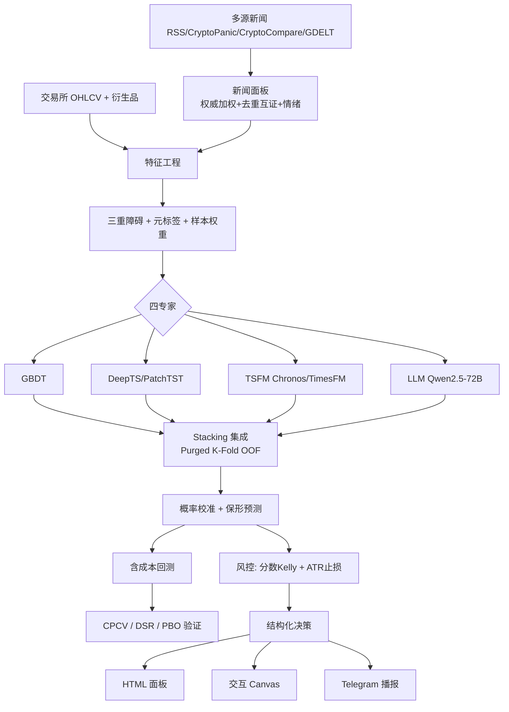

# Crypto-Alpha 系统架构详解

> BTC/ETH 做多/做空**概率 + 止损**多专家集成预测系统。
> 本文逐层说明**每个技术细节的作用、选型理由与优势**,并附**完整使用说明**。
> 面向:想深入理解或二次开发本系统的工程/量化人员。

---

## 目录

1. [设计哲学(为什么这样搭)](#1-设计哲学)
2. [系统总览与数据流](#2-系统总览与数据流)
3. [数据层](#3-数据层)
4. [特征层](#4-特征层)
5. [标注层(三重障碍 + 元标签)](#5-标注层)
6. [验证层(Purged CV / CPCV / DSR / PBO)](#6-验证层)
7. [专家层(四专家)](#7-专家层)
8. [集成层(Stacking)](#8-集成层)
9. [校准层(概率校准 + 保形预测)](#9-校准层)
10. [回测层(含成本)](#10-回测层)
11. [风控层(分数 Kelly + ATR 止损)](#11-风控层)
12. [服务与交付层](#12-服务与交付层)
13. [配置全解(config.yaml)](#13-配置全解)
14. [完整调用链](#14-完整调用链)
15. [使用说明](#15-使用说明)
16. [目录结构与脚本索引](#16-目录结构与脚本索引)
17. [横切关注点:防泄漏 & 防过拟合](#17-横切关注点)
18. [扩展指南](#18-扩展指南)
19. [已知局限与优化路线](#19-已知局限与优化路线)
20. [术语表](#20-术语表)

---

## 1. 设计哲学

整套系统围绕**四条铁律**设计,这也是它区别于"随手拼个模型跑回测"的关键:

| 铁律 | 含义 | 落地方式 |
|---|---|---|
| **无泄漏(No Leakage)** | 任何时刻只能用当时可获得的信息 | 因果特征、桶末标记、传播缓冲、as-of 对齐、Purged CV、Embargo |
| **无过拟合(No Overfitting)** | 好看的回测必须证明不是运气/挑参数挑出来的 | CPCV 多路径、去偏夏普 DSR、过拟合概率 PBO |
| **概率化 + 校准** | 输出"可下注的概率"而非硬涨跌标签 | 元标签二分类、Isotonic/Platt 校准、保形预测弃权 |
| **优雅降级(Graceful Degradation)** | 缺网络/缺 GPU/缺依赖也能跑通主干 | 合成数据/新闻兜底、TSFM naive 后端、专家可用性探测 |

**核心范式**:不是直接预测"下一根涨还是跌",而是
> ① 用一个简单主策略给出**方向**(side) → ② 用**三重障碍**判定该方向在"止盈/止损/超时"下**是否盈利**(元标签) → ③ 用**四专家集成**学习"该不该执行这个方向 + 盈利概率" → ④ 校准概率 → ⑤ 分数 Kelly 定仓 + ATR 定止损。

这就是 López de Prado《Advances in Financial Machine Learning》(下称 **AFML**)的**元标签(Meta-Labeling)**方法论,天然契合你"做多做空概率 + 止损"的需求。

---

## 2. 系统总览与数据流



**模块地图**(`src/crypto_alpha/`):

| 目录 | 职责 | 关键文件 |
|---|---|---|
| `data/` | 数据/新闻采集、缓存、情绪、历史回填 | `fetch.py` `news.py` `sentiment.py` `storage.py` |
| `features/` | 分数阶差分、技术指标、多周期上下文、新闻数值特征 | `frac_diff.py` `technical.py` `mtf.py` `news_features.py` `build.py` |
| `labeling/` | 三重障碍、元标签、样本权重 | `triple_barrier.py` `meta_labeling.py` `sample_weights.py` |
| `validation/` | Purged K-Fold、CPCV | `purged_kfold.py` `cpcv.py` |
| `experts/` | 四专家 + 抽象基类 | `gbdt.py` `deep_ts.py` `tsfm.py` `llm.py` `base.py` |
| `ensemble/` | Stacking 集成 | `stacking.py` |
| `calibration/` | 概率校准 + 保形预测 | `calibrate.py` |
| `backtest/` | 含成本回测 + DSR/PBO | `engine.py` |
| `risk/` | 仓位 + 止损 + 决策 | `sizing.py` |
| `pipeline/` | 端到端编排 + 评估 + 面板 | `run.py` `evaluate.py` `report.py` |

---

## 3. 数据层

### 3.1 行情采集与多年缓存(`data/fetch.py`)

| 组件 | 作用 | 技术选型与优势 |
|---|---|---|
| `fetch_ohlcv` | 拉取多年 K 线 | 用 **ccxt** 统一各交易所接口;`since` 起点 + `while` **分页**循环,单次上限 1000 根,自动翻页直至当前,支持**数年**历史 |
| 缓存层 | 避免重复拉取 | 首次全量拉取 → 落盘 `data/raw/<SYMBOL>.parquet`;之后复用。**Parquet** 列存 + 压缩,读写快、跨语言 |
| `_incremental_update` | 增量刷新 | 只从缓存**最后一根 bar** 之后 `since` 拉新数据并合并去重;多年回测的日常更新成本极低 |
| `fetch_derivatives` | 资金费率/持仓量 | best-effort;接口不支持则**降级为 NaN 列**,不阻断主流程 |
| `generate_synthetic_ohlcv` | 离线兜底 | **马尔可夫 regime 切换(震荡/牛/熊)+ GARCH 波动聚集**,刻意包含可学习结构,使模型/回测代码能被真实检验(而非对纯随机游走束手无策) |

**为什么合成数据要"有结构"**:如果兜底数据是纯随机游走,回测永远接近 0,无法验证流水线是否正确。GARCH+regime 让合成数据具备动量与波动聚集,从而 AUC 能略高于 0.5,证明代码链路有效。

统一输出:**UTC `DatetimeIndex`** + `open/high/low/close/volume`(+可选衍生品列)。时区统一是**防泄漏与对齐**的地基。

### 3.2 新闻多源采集与权威分层(`data/news.py`)

**为什么要接多个来源**:单一来源有偏、有延迟、易被操纵。多源可**交叉互证**、覆盖更全、抗单点失效。

**权威分层(tier)**——按可信度分 4 档并赋权:

| Tier | 来源类型 | 示例 | 权重 |
|---|---|---|---|
| T1 | 官方/监管 | SEC RSS | 1.0 |
| T2 | 一线财经/聚合 | Reuters, CoinDesk, CryptoCompare, CryptoPanic, GDELT | 0.7 |
| T3 | 加密媒体 | Cointelegraph, 金色财经 | 0.4 |
| T4 | 社媒/弱源 | — | 0.15 |

**关键算法**:

- **去重 + 互证**(`dedup_corroborate`):标题 token 的 **Jaccard 相似度** ≥ 0.6 归并为同一事件;归并后记录 `corroboration = 独立来源数`,`tier` 取最高。**时间窗(默认 48h)约束**:只归并窗内的多源报道——因为"互证"是"多源近乎同时报道同一事件",跨月同名标题不应合并(否则多年语料会**塌缩**到最早的少数簇,破坏历史回测)。只与"活跃簇"比较,保证多年语料下近似线性复杂度。
- **权威度**:`authority = tier_weight × (1 + 0.3×(证数−1))`,上限 2.0。越权威、越多源互证的新闻,对情绪的贡献越大。
- **聚合成面板**(`build_news_panel`):按 `bucket`(默认 1h)分桶,桶内按权威加权算情绪、取 Top-K 头条生成摘要。**桶时间戳用桶末(可用时刻)而非桶左沿**,根除同期前视泄漏。

来源优先级(自适应):`use_history`(历史原始库)> `use_synthetic`(合成)> 实时抓取。

### 3.3 情绪打分(`data/sentiment.py`)

可插拔后端,输出**概率加权有符分数** `score = P(看多) − P(看空)`(而非 argmax,更平滑、可校准):

| backend | 模型 | 适用 |
|---|---|---|
| `lexicon` | 中英情绪词典 | 零依赖兜底 |
| `cryptobert` | ElKulako/cryptobert | 英文加密 |
| `finbert` | 英文金融 | 英文财经 |
| `chinese` | Erlangshen 中文情绪 | 中文 |
| `multilingual` | 中英双模型融合 | **推荐**:按语言路由(英→CryptoBERT,中→中文模型),混合按权重融合 |

**通用标签映射**自动识别 bull/positive/正面、bear/negative/负面;对 `LABEL_0/1` 无语义标签支持显式 `label_map`;二/三分类有序兜底。**批量推理 + 磁盘缓存 + 设备自适应**;加载失败**优雅回退词典**。

### 3.4 历史回填与原始语料库(`data/news.py` + `scripts/09`)

多年回测需要多年新闻。设计上**原始库与聚合面板分离**:

- **原始库** `data/news_raw/corpus.parquet`(一行=一篇原始报道)+ `backfill_state.json` 续跑检查点。抓取**可增量、可续跑**(按 `source+title+published_at` 去重,天然幂等)。
- **分页/分窗抓取**:`cryptocompare` 用 `lTs` 向历史翻页;`gdelt` 把日期区间切窗(每窗 ≤250);`synthetic` 离线生成多年语料。
- 面板可随时用当前库**重建**(`use_history=true`),这样价格与新闻都能覆盖多年。

---

## 4. 特征层

所有特征**严格因果**(仅用 t 时刻及之前信息)。

### 4.1 分数阶差分 FFD(`features/frac_diff.py`)

**问题**:价格非平稳(模型难学),但整数阶差分(如收益率)虽平稳却**抹掉了长记忆**(丢失预测力)。

**方案**:López de Prado 的**分数阶差分**——用非整数阶 `d`(默认 0.4)在"平稳"与"保留记忆"间取平衡。固定宽度窗口法(FFD)在权重绝对值 < `thres` 时截断,得到可计算的有限窗口。

**优势**:特征既平稳(满足模型假设)又保留了价格的长期信息,比单纯用收益率更有预测力。

### 4.2 技术指标(`features/technical.py`)

多窗口(`[7,14,28,56]`)计算:收益率、动量、滚动波动、RSI(EWM 实现)、z-score、布林带内位置、量比;外加 MACD、ATR(止损/障碍基准)、已实现波动率 `rv`(标签目标尺度)。衍生品:`funding_z`(资金费率 z-score)、`oi_change`(持仓量变化)。

**为什么多窗口**:不同周期捕捉不同节奏的动量/均值回归结构,给树模型更丰富的切分维度。注意这是**同一主周期上的不同回看长度**,不是另拉 5m/15m K 线。

### 4.3 多周期上下文 MTF(`features/mtf.py`)——方案B

**做法**:主周期(默认 `1h`)负责标注与训练索引;辅周期(`aux_timeframes`,默认 `4h`/`1d`)只提供**已收盘**高周期趋势/波动特征,经 as-of 并入主面板。**不**按周期分别训练多套模型。

**防泄漏**:
- 交易所惯例:K 线时间戳=开盘时刻;
- 辅周期 bar 开盘 `u`、长度 `Δ_aux` ⇒ 可用时刻 `available_at = u + Δ_aux`;
- 主周期 bar 开盘 `t`、长度 `Δ_main` ⇒ 决策时刻 `decision_at = t + Δ_main`(与「索引 t 的特征已含该 bar close」口径一致);
- `merge_asof(backward)` 条件:`available_at ≤ decision_at`。

因此 09:00 的 1h bar(决策 10:00)看不到 08:00–12:00 尚未收盘的 4h 特征;11:00 的 1h bar(决策 12:00)才能用上。

**合成模式**:辅周期由主周期 `resample`(open/high/low/close/volume),保证同一价格路径,禁止独立再生成一套假 4h/1d。

**配置**:`data.aux_timeframes` + `features.mtf_enabled` / `mtf_lookbacks` / `mtf_include_confluence`。细于主周期的辅周期会被拒绝/跳过。

### 4.4 新闻数值特征(`features/news_features.py`)——不止喂 LLM

新闻的数值信号(情绪/互证/条数/权威度)以**无泄漏 as-of + 时间衰减**并入面板,供 **GBDT/DeepTS/TSFM 全体专家共享**。

产出列:`news_sentiment`(衰减后)、`news_sentiment_raw`、`news_corroboration`、`news_n_items`、`news_max_authority`、`news_age_hours`、`has_recent_news`、`news_sent_ema`。

**防泄漏三重保证**:
1. 新闻桶用**桶末(可用时刻)**标记(而非桶左沿),根除同期前视;
2. 再加 `buffer_minutes` 传播缓冲(新闻发布后需时间才可交易);
3. `merge_asof(backward)` 只对齐"可用时刻 ≤ bar 时间"的最新新闻。

**时间衰减**:影响按 `feature_halflife_hours` 指数衰减,超过 `feature_ttl_hours` 归零(避免陈旧新闻污染当前判断);缺新闻一律填 0/中性,不引入 NaN、不丢样本。

---

## 5. 标注层

### 5.1 CUSUM 事件采样(`triple_barrier.cusum_filter`)

**不对每根 bar 都建仓**,只在累计价格偏移超阈值时采样。**优势**:样本更独立、更少冗余,减少高相关样本对训练的主导。

### 5.2 三重障碍(`triple_barrier.py`)

对每个候选入场点设三条障碍:
- **上障碍(止盈)** = `+pt × 当时波动`
- **下障碍(止损)** = `−sl × 当时波动`
- **垂直障碍(时间)** = 最多持有 `vertical_barrier_bars` 根

首次触碰哪条决定结果,且**用 bar 内 `high/low` 判定盘中触碰**(与实盘"止损/止盈常在 bar 内被最高/最低价先打到"一致;同 bar 双触保守判止损)。**止损宽度由波动率(`trgt=rv`)自适应**(而非固定点数)——**止损天然内建于标签**,无需模型另猜。

> ⚠️ **口径差异(需知悉)**:标签/回测的障碍用 `rv`(对数收益滚动 std)× `pt_sl` 倍数;而实盘 `risk.decide()` 展示的止损/止盈用 `ATR × atr_stop_mult`。两者是**不同的波动度量**,数值不完全对应。回测胜率/盈亏比对应的是 `rv` 障碍,实盘挂单口径为 ATR。若要严格一致,应把二者统一为同一度量(路线见 §19)。

### 5.3 主信号 + 元标签(`meta_labeling.py`)

- `primary_signal`:`momentum`(近 N 收益为正→做多)或 `meanrev`(高于均值→做空),给出方向 `side ∈ {+1,−1}`。
- 三重障碍在该方向上给出 `bin ∈ {0,1}`(该信号是否盈利)。
- 四专家集成学习"**该不该执行主信号 + 概率**"= 元标签。

**为什么用元标签而非直接预测方向**:把"择时(方向)"与"择质(该不该做、多大概率成)"解耦,让 ML 专注于过滤劣质信号、输出可校准概率,显著降低难度、提升精度与可解释性。

### 5.4 样本权重(`sample_weights.py`)

金融标签因持有期重叠而**不独立**。两类权重相乘并归一:
- **平均唯一性**:事件持有期内 `1/并发事件数` 的均值——重叠越多、权重越低,避免高相关样本主导。
- **收益幅度**:`|ret| × 唯一性`——信息量大的样本权重更高。
- **时间衰减**:越新的样本权重越高(最旧 = `last_weight`)。

这些权重贯穿 GBDT/DeepTS/LLM 训练与回测,是 AFML ch.4 的标准做法。

---

## 6. 验证层

> 这是本系统**准度可信度的核心闸门**,比单看 AUC 重要得多。

### 6.1 Purged K-Fold + Embargo(`validation/purged_kfold.py`)

普通 KFold 会把与测试集**时间重叠**的样本留在训练集里 → 信息泄漏 → 分数虚高。

- **Purge(清洗)**:训练样本若其标签区间 `[t_start, t1]` 与测试段重叠,则剔除。
- **Embargo(禁运)**:测试段之后再禁用一小段样本(`embargo_pct`),切断残余自相关泄漏。

用于 Stacking 生成无泄漏 OOF(见第 8 节)。

### 6.2 CPCV(`validation/cpcv.py`)

把样本切成 N 组,每次取 k 组做测试,遍历 `C(N,k)` 种组合,生成 **φ = C(N,k)·k/N** 条**互不相同的回测路径**(而非 walk-forward 的单一路径),得到**夏普比率的分布**。

### 6.3 去偏夏普 DSR & 过拟合概率 PBO(`backtest/engine.py`)

- **DSR**:多次尝试下,期望最大夏普会虚高;DSR 校正后给出"**真实夏普 > 0 的概率**"。
- **PBO**:通过组合式划分比较"样本内最优配置"在样本外的排名,估计**过拟合概率**。**PBO > 0.5 说明你挑到的最优配置在样本外大概率不再最优**——即过拟合。

**发布准则**:AUC 高但 `DSR` 低 / `PBO > 0.5` → 拒绝上线。运行:`python scripts/10_run_all.py --cpcv` 或 `scripts/05_cpcv_report.py`。

---

## 7. 专家层

四类专家覆盖**互补的信息维度**,误差不相关 → 集成后方差下降、稳健性升。统一继承 `experts/base.py` 的 `BaseExpert`(`fit / predict_proba / clone / set_panel`)。

### 7.1 GBDT(`experts/gbdt.py`)

- **模型**:LightGBM。**优势**:表格特征之王,处理非线性/交互/缺失强、训练快、可解释(特征重要度),是最稳的基座专家。
- 直接吃全部数值特征(技术 + 分数阶差分 + 新闻)。

### 7.2 深度时序 DeepTS / PatchTST(`experts/deep_ts.py`)

- **模型**:纯 PyTorch 自实现的 **PatchTST 风格** Transformer——把回看窗口切成 patch、线性嵌入 + 位置编码 + TransformerEncoder + 均值池化 + 分类头。
- **作用**:用注意力捕捉**多变量、长依赖**的时序模式,提供与树模型互补的视角。
- 训练:`BCEWithLogitsLoss` 按样本权重加权;按训练集统计标准化并保存供推理。缺 torch 时抛清晰提示,不影响其他专家。

### 7.3 时序基础模型 TSFM(`experts/tsfm.py`)

- **后端**:`chronos`(amazon/chronos-bolt,单变量)/ `timesfm`(支持原生协变量)/ `naive`(内置动量基线,零依赖离线兜底)。缺依赖自动回退 naive。
- **协变量融合(关键)**:Chronos 原生**不支持外生变量**,故用"**协变量融合头**":`TSFM 预测分 ⊕ 新闻协变量 → 逻辑回归/GBDT 头 → P(盈利)`。该机制对任意基线预测器通用,且严格无泄漏(协变量为已 as-of 对齐的 `news_*`)。TimesFM 2.0+ 走原生协变量路径。
- 预测分 = `side × 预测收益 /(波动×√horizon)`,再由头模型概率化。

### 7.4 大语言模型 LLM(`experts/llm.py` + `scripts/train_llm_qlora.py`)

- **模型**:Qwen2.5-72B-Instruct,**QLoRA 4-bit** 微调(单张 80GB 卡,约 48–65GB,≤100GB 约束内)。
- **概率来源:Verbalizer**(不做自由文本生成再正则解析):让模型回答 "1(会盈利)" 或 "0",推理时读取答案位上 token "1" vs "0" 的 **softmax 概率**得到连续 `P(盈利)`。这样训练目标(SFT 到 1/0)与推理口径完全一致,且概率**可被下游校准**。
- **作用**:把"结构化指标摘要 + 新闻/事件文本"转成自然语言推理,覆盖纯数值模型看不到的**事件驱动**维度;新闻按事件时间无泄漏 as-of 注入 prompt。
- 训练脚本用**样本权重加权 SFT 损失**、按时间切分验证集(无泄漏)、loss 只对答案 token 计算。

**可用性探测(`pipeline/report.probe_experts`)**:联跑前逐个探测依赖/GPU/adapter,不可用者跳过并说明原因(如"无 CUDA GPU"),保证一键联跑在任何机器都能跑通可用子集。

---

## 8. 集成层(Stacking,`ensemble/stacking.py`)

**Stacking(堆叠泛化)**:
1. 用 **Purged K-Fold** 为每个专家生成**无泄漏 OOF 概率**(元学习器绝不会看到自己训练样本的预测);
2. 以 OOF 概率矩阵为二层特征,训练**元学习器**(`logistic` 默认 / `gbdt`)融合;
3. 各专家再在全量数据上重训,供部署推理。

**优势**:因各专家误差不相关,融合后**方差下降、稳健性与准度提升**;元学习器自动学习各专家可信度(弱专家被压低权重)。`oof_proba()` 输出的无泄漏融合概率用于校准与回测。

---

## 9. 校准层(`calibration/calibrate.py`)

- **概率校准**(`ProbabilityCalibrator`,Isotonic/Platt):让"模型说 70%"真的对应约 70% 的经验频率。**为什么必须**:仓位管理(Kelly)直接用概率定仓,未校准概率会让仓位系统性失真。在 OOF 上拟合(无泄漏)。
- **保形预测**(`ConformalBinary`,分裂式):给出有覆盖率保证的预测集;当预测集不确定(同时包含两类)时**弃权观望**,只在高置信时下注,提升下单子集的实际胜率。
- `classification_report_probs`:统一给出 AUC / Brier / logloss / accuracy / base_rate。

---

## 10. 回测层(`backtest/engine.py`)

- **事件级含成本回测**:对每个事件,校准概率 > `prob_threshold` 才下注,按分数 Kelly 定 size,计入**手续费 + 滑点 + 资金费**(开平各一次),PnL 按入场时间复利成净值曲线。
- **指标**:总收益、Sharpe、最大回撤、Calmar、胜率、交易数。
- 与 **CPCV** 联动产出 DSR/PBO(见第 6 节)。

**为什么用无泄漏 OOF 概率回测**:直接用训练集内预测回测=作弊;用 OOF 才是对样本外表现的诚实估计。

---

## 11. 风控层(`risk/sizing.py`)

- **分数 Kelly**:`f* = (p·(b+1)−1)/b`(b=盈亏比),乘以 `kelly_fraction`(默认半 Kelly)并封顶 `max_position_pct`。**优势**:Kelly 最大化长期复利,分数 Kelly 大幅降低回撤波动。
- **ATR 止损**:`stop = entry − side × atr_stop_mult × ATR`(注意与标签的 `rv` 障碍是不同波动度量,见 §5.2)。
- **保形弃权**:`decide(..., confident=...)` 接入 `ConformalBinary.predict_set`——预测集不唯一(低置信)时**强制 `HOLD`**,与研究链(`latest_decision`)、实盘链(`serve.decide_live`)口径一致。
- **HOLD 不出挂单**:`signal=HOLD` 时 `stop_loss/take_profit` 置 `None`(并给出 `reason`),避免被误当作可执行订单。
- **`decide()`**:输出结构化决策——`signal`(LONG/SHORT/HOLD)、`win_probability`、`entry_price`、`stop_loss`、`take_profit`、`suggested_position_pct`、`atr`、`confident`。这就是系统的"使用方式":输入最新市场状态,输出这条 JSON。

---

## 12. 服务与交付层

| 交付物 | 脚本 | 说明 |
|---|---|---|
| **单次决策** | `06_decide.py` | 训练→对最新 bar 出一条决策 JSON |
| **实时服务** | `07_serve.py` | 训练一次→周期拉最新数据出决策→去重→播报;`retrain_every_cycles` 周期重训应对漂移;默认只推 LONG/SHORT |
| **Telegram 播报** | `serve.telegram` | 配 `TELEGRAM_BOT_TOKEN`/`TELEGRAM_CHAT_ID` 环境变量启用;缺配置回退控制台 |
| **HTML 结果面板** | `10_run_all.py` | 一键全专家联跑→自包含 `artifacts/dashboard.html`(离线可看):决策卡/回测 KPI/专家对比/内嵌净值图/可选 CPCV |
| **交互 Canvas** | `11_make_canvas.py` | 生成可在 Cursor 并排打开的实时 React 面板:币种/指标切换、双币净值对比(状态持久化) |

---

## 13. 配置全解(`config/config.yaml`)

> 所有脚本从此文件读参数,保证可复现。

### data
| 键 | 作用 |
|---|---|
| `exchange` / `symbols` / `timeframe` / `aux_timeframes` | 交易所、币种、主周期、辅周期(仅上下文特征,须粗于主周期) |
| `since` | 真实数据回填起点(多年回测) |
| `use_synthetic` | true=合成兜底;false=真实数据 |
| `synthetic_bars` | 合成 bar 数 |
| `cache` / `incremental_update` | 真实数据缓存 + 增量刷新 |
| `fetch_derivatives` | 是否拉资金费率/持仓量 |

### news
| 键 | 作用 |
|---|---|
| `use_synthetic` / `use_history` | 合成新闻 / 用历史原始库聚合 |
| `bucket` / `top_k` / `buffer_minutes` | 聚合粒度 / 头条数 / 传播缓冲 |
| `dedup_window_hours` | 互证归并时间窗(防多年语料塌缩) |
| `as_feature` / `feature_ttl_hours` / `feature_halflife_hours` / `feature_ema_span` | 新闻数值特征开关与衰减 |
| `tier_weights` | 各权威档权重 |
| `sentiment.*` | 情绪后端(lexicon/cryptobert/finbert/chinese/multilingual)与融合 |
| `sources` | 真实来源列表(rss/cryptopanic/cryptocompare/gdelt) |
| `history.*` | 回填目录/起止/来源/分窗/限速 |

### features / labeling / validation
| 键 | 作用 |
|---|---|
| `features.frac_diff_d` / `frac_diff_thres` | 分数阶差分阶数/截断阈 |
| `features.windows` / `vol_window` | 技术指标窗口 / 波动窗口 |
| `features.mtf_enabled` / `mtf_lookbacks` / `mtf_*` | 多周期上下文开关与辅周期特征窗口 |
| `labeling.pt_sl` | 止盈/止损倍数 [pt, sl] |
| `labeling.vertical_barrier_bars` | 最大持有 bar 数 |
| `labeling.min_ret` / `primary_signal` / `primary_lookback` | 最小目标波动 / 主信号类型 / 回看 |
| `validation.n_splits` / `n_test_groups` / `embargo_pct` | CPCV 组数 / 测试组数 k / 禁运比例 |

### experts / ensemble / calibration / backtest / risk / serve
| 键 | 作用 |
|---|---|
| `experts.enabled` | 启用哪些专家 |
| `experts.gbdt/deep_ts/tsfm/llm.*` | 各专家超参 |
| `ensemble.meta_learner` / `C` | 元学习器类型 / 正则 |
| `calibration.method` / `conformal_alpha` | 校准法 / 保形显著性 |
| `backtest.fee_bps/slippage_bps/funding_bps_per_bar/prob_threshold` | 成本 / 下注阈值 |
| `risk.kelly_fraction/max_position_pct/atr_stop_mult/daily_max_drawdown` | 仓位 / 止损 / 熔断 |
| `serve.*` | 轮询/重训/去重/Telegram |

---

## 14. 完整调用链

```
prepare_dataset(cfg, symbol)                      # pipeline/run.py
├─ load_symbol_data            → 行情(缓存/增量/合成)
├─ build_feature_matrix        → 分数阶差分 + 技术指标 + 多周期MTF(4h/1d as-of)
├─ add_news_features           → 新闻数值特征(as-of + 衰减)
└─ build_meta_labels           → CUSUM → 三重障碍 → 元标签 + 样本权重
        │
train_and_validate(cfg, ds)                       # pipeline/run.py
├─ build_experts               → 探测/构造专家 + 注入面板/新闻
├─ StackingEnsemble.fit        → Purged K-Fold OOF → 元学习器
├─ oof_proba                   → 无泄漏融合概率
├─ ProbabilityCalibrator.fit   → 校准
├─ ConformalBinary.fit         → 保形弃权阈
└─ backtest_events             → 含成本回测(用 OOF 校准概率)
        │
latest_decision(cfg, ds, trained)  → decide()     # risk/sizing.py → 结构化 JSON
cpcv_report(cfg, ds, build_experts)               # pipeline/evaluate.py → DSR/PBO
```

---

## 15. 使用说明

### 15.1 安装

```powershell
pip install -e .                 # 核心(numpy/pandas/sklearn/lightgbm...)
pip install -e ".[data]"         # 真实行情: ccxt
pip install -e ".[deep]"         # 深度时序: torch
pip install -e ".[tsfm]"         # 时序基础模型: chronos-forecasting / timesfm
pip install -e ".[llm]"          # LLM: transformers peft bitsandbytes accelerate datasets
pip install -e ".[sentiment]"    # 情绪模型: transformers + torch
```

### 15.2 快速开始(合成数据,无需网络/GPU)

```powershell
python tests/test_smoke.py                 # 30 秒跑通主干
python scripts/01_fetch_data.py            # 数据
python scripts/02_build_features.py        # 特征
python scripts/03_label.py                 # 标注概览
python scripts/04_train_and_backtest.py    # 训练+校准+回测+决策+净值图
python scripts/05_cpcv_report.py           # CPCV: DSR + PBO
python scripts/06_decide.py                # 最新决策 JSON
python scripts/08_fetch_news.py            # 采集/合成新闻
python scripts/10_run_all.py               # ★一键全专家联跑 + HTML 面板
python scripts/11_make_canvas.py           # ★交互 Canvas 面板
```

### 15.3 切换真实数据 + 真实新闻(多年回测)

```powershell
# 1) config.yaml: data.use_synthetic=false; news.use_synthetic=false 或 use_history=true
pip install -e ".[data]"
$env:CRYPTOCOMPARE_KEY="..."; $env:CRYPTOPANIC_KEY="..."
python scripts/09_backfill_news.py --start 2021-01-01 --providers gdelt cryptocompare
# 2) config.yaml: news.use_history=true
python scripts/10_run_all.py --cpcv        # 真实多年 + 过拟合检验
```

### 15.4 启用四专家(需 GPU)

```powershell
pip install -e ".[deep]" ".[tsfm]" ".[llm]"
python scripts/train_llm_qlora.py          # 先微调 Qwen2.5-72B(单张 80GB 卡)
# config.yaml: experts.enabled=["gbdt","deep_ts","tsfm","llm"]
python scripts/10_run_all.py --cpcv
```

### 15.5 实时服务与播报

```powershell
$env:TELEGRAM_BOT_TOKEN="..."; $env:TELEGRAM_CHAT_ID="..."
python scripts/07_serve.py --once          # 跑一轮
python scripts/07_serve.py --loop          # 常驻轮询 + 播报
```

### 15.6 问什么答什么(输出示例)

```json
{
  "symbol": "BTC/USDT",
  "signal": "LONG",
  "win_probability": 0.63,
  "entry_price": 64200.0,
  "stop_loss": 62850.0,
  "take_profit": 66600.0,
  "suggested_position_pct": 0.12
}
```

---

## 16. 目录结构与脚本索引

| 脚本 | 阶段 |
|---|---|
| `01_fetch_data.py` | 采集/合成行情 |
| `02_build_features.py` | 构建特征(含新闻数值特征) |
| `03_label.py` | 三重障碍 + 元标签 |
| `04_train_and_backtest.py` | 训练 + 校准 + 回测 + 决策 + 净值图 |
| `05_cpcv_report.py` | CPCV / DSR / PBO |
| `06_decide.py` | 单次决策 JSON |
| `07_serve.py` | 实时服务 + 播报 |
| `08_fetch_news.py` | 新闻采集/合成 → 面板 |
| `09_backfill_news.py` | 历史新闻回填(多年) |
| `10_run_all.py` | ★一键全专家联跑 + HTML 面板 |
| `11_make_canvas.py` | ★交互 Canvas 面板 |
| `train_llm_qlora.py` | Qwen2.5-72B QLoRA 微调 |

---

## 17. 横切关注点:防泄漏 & 防过拟合

> 说明:以下清单用**三态**标注,避免"文档声称 ≠ 代码实现"。
> `[x]` 已实现且有测试/代码支撑 · `[~]` 已实现但有简化/需人工开启 · `[ ]` 未接线/路线图。

**防泄漏检查表**(贯穿全系统):
- [x] 所有特征仅用 t 及之前信息(技术指标、分数阶差分因果实现)
- [x] 多周期辅特征:辅 bar 收盘可用时刻 ≤ 主 bar 决策时刻(`features/mtf.py`) — `tests/test_mtf.py` 验证
- [x] 新闻桶用桶末标记 + `buffer_minutes` 传播缓冲 + `merge_asof(backward)` — `tests/test_leakage.py` 验证
- [x] 三重障碍/样本权重保留 tz-aware 时间(避免时区丢失导致的错配)
- [x] Stacking 一层 OOF 用 Purged K-Fold(+ Embargo) — `tests/test_leakage.py` 验证
- [x] **二层元学习器亦走 nested OOF**(此前"自训自评"泄漏已修复)
- [x] **校准用交叉拟合**(`cross_fitted_calibrated`),回测/报告用无泄漏概率(此前"拟合即评估"乐观偏差已修复)
- [x] **合成新闻守卫**:真实价格禁用未来构造的合成新闻(`tests/test_leakage.py` 验证)
- [x] 三重障碍 `high/low` bar 内触碰(`tests/test_leakage.py` 验证)

**防过拟合检查表**:
- [~] CPCV 多路径 → 夏普分布(有代码,`10_run_all` 需显式 `--cpcv` 开启; **路径内已与主训练一样做校准**)
- [~] DSR 校正多次尝试偏差(`n_obs` 用成交笔数;`n_trials` 由 `validation.dsr_n_trials` **人工如实**设定,否则去偏失效)
- [~] PBO 量化"最优配置样本外失效"概率(配置维度 <8 时统计力弱,结果带 `pbo_warning`)
- [x] 样本权重降低重叠样本主导(一层与二层元学习器均加权)
- [x] 弱专家剪枝:OOF AUC < `ensemble.min_expert_auc`(默认 0.5)自动剔除
- [x] 概率校准 + 保形弃权,只在高置信下注(已接入 `decide`/`serve`)

**回测真实性(务必知悉的简化)**:
- [x] **组合级资金占用**(默认 `backtest.portfolio_mode=true`): 并发仓位共享权益、受 `max_gross_exposure` 约束; 可选 `false` 回退旧版独立复利对照
- [x] 资金费按持有 `bars_held` 累计;手续费/滑点开平各一次
- [x] 夏普另给按成交频率年化的 `sharpe_annualized`
- [x] 日内熔断 `risk.daily_max_drawdown`:当日回撤触阈后停开当日剩余仓位
- [x] **标签/实盘波动口径统一**: 默认 `labeling.barrier_vol=atr`(相对 ATR), `decide` 止盈止损直接用 `pt_sl` 倍数 × ATR

---

## 18. 扩展指南

- **加一个专家**:继承 `experts/base.BaseExpert`,实现 `fit/predict_proba/clone`,在 `experts/__init__.EXPERT_REGISTRY` 注册,`config.experts.enabled` 加名即可自动进入 Stacking。
- **加一个新闻源**:在 `config.news.sources` 加一条(`rss/cryptopanic/cryptocompare/gdelt`),或在 `news.py` 加新适配器(遵循归一化 schema:`published_at/source/tier/title/url/symbols`)。
- **改标注**:调 `labeling.pt_sl / vertical_barrier_bars / primary_signal`;或在 `triple_barrier.py` 加新障碍逻辑(如 regime 自适应)。
- **加协变量给 TSFM**:`config.experts.tsfm.covariate_cols` 指定列名(或 `auto` 用全部新闻特征)。

---

## 19. 已知局限与优化路线

| 局限 | 现状 | 优化方向(优先级) |
|---|---|---|
| 真实数据依赖网络 | 默认 `use_synthetic=false`, 失败自动降级合成 | ★★★ 预拉缓存 + 真实历史新闻回填后跑 `--cpcv` |
| 缺微观结构 | 资金费率/OI 已分页回填, 仍无清算/多空比/链上 | ★★★ 接清算/多空比/基差 |
| 多周期已落地为特征 | 辅周期不单独训练;默认 4h/1d(`features/mtf.py`) | ★ 若需入场精度再评估更细主周期(成本/SNR 权衡) |
| 深度时序未增值 | 已加时间切分 early stop; 短样本仍可能被剪枝 | ★★ 真实多年数据 + 超参搜索 |
| CPCV 默认关 | 有代码且路径内已校准; `10_run_all` 需 `--cpcv` | ★★★ 发布前必跑 `--cpcv`,PBO>0.5 拒上线 |
| 多币种组合 | 单币回测已组合化; BTC+ETH 仍分账户 | ★ 跨标的统一权益池 |
| TSFM 未真微调 | 冻结预测 + 浅头(TimesFM 未实现) | ★★ 真监督微调或降级为显式基线 |
| LLM 可选 | 默认目标改 32B, 仍非默认启用 | ★ 有文本 alpha 时再开 |
| DSR n_trials | 需人工如实设定研究试验次数 | ★ 接入实验追踪(MLflow)自动统计试验数 |
| 校准全局单一 | 不分市场状态 | ★ 分 regime 校准 |
| 障碍固定倍数 | `pt_sl` 恒定 | ★ 随 regime 自适应障碍 |
| 执行成本简化 | 固定 bps + 近似资金费 | ★ 更真实的滑点/延迟/资金费建模 + vol targeting |

**诚实判断**:1h 频率加密市场接近有效,"方向准度"空间有限;系统价值在于**无泄漏 + 严格验证 + 概率校准 + 风险调整**,让"小而稳的 edge"被安全放大。

---

## 20. 术语表

| 术语 | 含义 |
|---|---|
| **元标签 Meta-Labeling** | 先定方向、再用 ML 判"该不该做+概率"的两段式范式 |
| **三重障碍** | 止盈/止损/时间三条障碍决定标签,止损内建 |
| **CUSUM** | 累计偏移采样,只在显著变动时建仓 |
| **FFD** | 固定宽度窗口分数阶差分,平稳且保留记忆 |
| **Purged K-Fold** | 清洗重叠样本 + 禁运,防时序泄漏的交叉验证 |
| **CPCV** | 组合式净化交叉验证,生成多条回测路径 |
| **DSR** | 去偏夏普,校正多次尝试的选择偏差 |
| **PBO** | 回测过拟合概率 |
| **OOF** | Out-Of-Fold,交叉验证中样本外预测 |
| **Verbalizer** | 让 LLM 输出 1/0 token 概率作为分类概率 |
| **QLoRA** | 4-bit 量化 + LoRA 的高效大模型微调 |
| **分数 Kelly** | Kelly 最优下注比例乘一个 <1 的系数,降回撤 |

---

_本文档随系统演进更新。实现细节以 `src/crypto_alpha/` 源码为准。仅供研究,非投资建议。_
